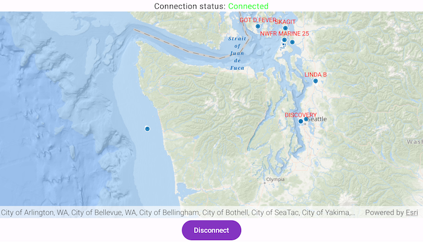

# Add custom dynamic entity data source

Create a custom dynamic entity data source and display it using a dynamic entity layer.

## Use case

Developers can create a custom `DynamicEntityDataSource` to be able to visualize data from a variety of different feeds as dynamic entities using a `DynamicEntityLayer`. An example of this is in a mobile situational awareness app, where a custom `DynamicEntityDataSource` can be used to connect to peer-to-peer feeds in order to visualize real-time location tracks from teammates in the field.

## How to use the sample

Run the sample to view the map and the dynamic entity layer displaying the latest observation from the custom data source. Tap on a dynamic entity to view its attributes in LogCat.

## How it works

Configure the custom data source:

1. Create a custom data source using a `CustomDynamicEntityDataSource.EntityFeedProvider`.
2. Override `feed` with a `SharedFlow<CustomDynamicEntityDataSource.FeedEvent>`.
3. Override `onLoad()` to specify the `DynamicEntityDataSourceInfo` for a given unique entity ID field and a list of `Field` objects matching the fields in the data source.
4. Override `OnConnect()` to begin asynchronously processing observations from the custom data source.
5. Loop through the observations and deserialize each observation into a `Point` object and a `Map<String, Any?>` containing the attributes.
6. Emit an observation in the custom data source `feed` with `CustomDynamicEntityDataSource.FeedEvent.NewObservation(point, attributes)`.

Configure the MapView:

1. Create a `DynamicEntityLayer` using the custom data source implementation.
2. Update values in the layer's `trackDisplayProperties` to customize the layer's appearance.
3. Set up the layer's `labelDefinitions` to display labels for each dynamic entity.
4. Use `MapView.identify(...)` to display a dynamic entity's attributes in the log.

## Relevant API

* CustomDynamicEntityDataSource.EntityFeedProvider
* DynamicEntity
* DynamicEntityDataSource
* DynamicEntityLayer
* LabelDefinition
* TrackDisplayProperties

## About the data

This sample uses a [.json file containing observations of marine vessels in the Pacific North West](https://www.arcgis.com/home/item.html?id=a8a942c228af4fac96baa78ad60f511f) hosted on ArcGIS Online.

## Additional information

In this sample, we iterate through features in a GeoJSON file to mimic messages coming from a real-time feed. You can create a custom dynamic entity data source to process any data that contains observations which can be translated into map points (`com.arcgismaps.geometry.Point` objects) with associated `Map<String, Any?>` attributes.

This sample uses the GeoViewCompose Toolkit module to implement a Composable MapView, which supports the use of [Callouts](https://github.com/Esri/arcgis-maps-sdk-kotlin-toolkit/tree/v.next/toolkit/geoview-compose#display-a-callout).

## Tags

callout, data, dynamic, entity, flow, label, labeling, live, real-time, stream, track
