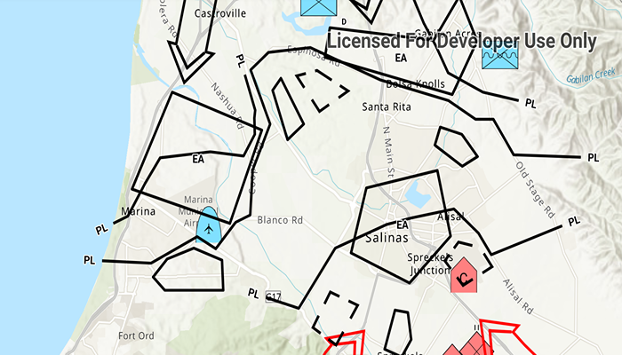

# Apply Dictionary Renderer To Feature Layer

Convert features into graphics to show them with mil2525d symbols.

## Use case

A dictionary renderer uses a style file along with a rule engine to display advanced symbology. This is useful for displaying features using precise military symbology.

## How to use the sample

Pan and zoom around the map. Observe the displayed military symbology on the map.

## How it works

1. Create a `Geodatabase` using `new Geodatabase(geodatabasePath)`.
2. Load the geodatabase using `Geodatabase.load()`.
3. Instantiate a `DictionarySymbolStyle`  using `DictionarySymbolStyle.createFromFile(dictionarySymbolStylePath)`.
4. Load the symbol dictionary using `dictionarySymbolStyle.load()`.
5. For each `GeoDatabaseFeatureTable` in the `GeoDatabase`, create a feature layer with it, then add it to the map using `map.operationalLayers.add(featureLayer)`.
6. Create `DictionaryRenderer(dictionarySymbolStyle)` and assign it to the feature layer renderer.
7. Set the viewpoint of the map view to the extent of the feature layer using `mapView.setViewpoint(Viewpoint(featureLayer.fullExtent))`.

## Relevant API

* DictionaryRenderer
* DictionarySymbolStyle
* Geodatabase
* FeatureLayer

## Tags

military, symbol
