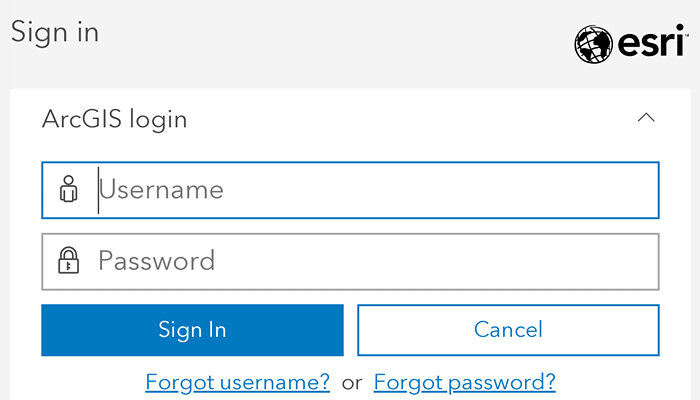
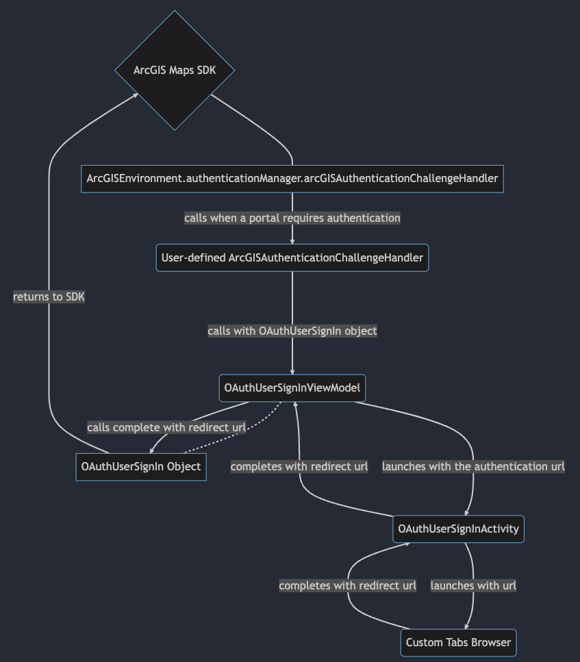

# Authenticate with OAuth

Authenticate with ArcGIS Online (or your own portal) using OAuth2 to access secured resources (such as private web maps or layers). Accessing secured items requires logging in to the portal that hosts them (an ArcGIS Online account, for example).

## Use case

Your app may need to access items that are only shared with authorized users. For example, your organization may host private data layers or feature services that are only accessible to verified users. You may also need to take advantage of premium ArcGIS Online services, such as geocoding or routing services, which require a named user login.

## How to use the sample

When you run the sample, the app will load a web map which contains premium content. You will be challenged for an ArcGIS Online login to view the private layers. Enter a user name and password for an ArcGIS Online named user account (such as your ArcGIS for Developers account). If you authenticate successfully, the traffic layer will display, otherwise the map will contain only the public basemap layer.

## Use of Model View ViewModel (MVVM)

This sample takes advantage of Android's `ViewModel` to encapsulate launching the OAuth user sign in prompt, establishing the activity result contract, verifying the OAuth user's credentials.

1. An Activity which launches a custom tab intent and sets its own result to the redirect url of the custom tab's result
2. A ViewModel which launches the above activity when prompted, and when it receives the result, passes it through to the `OAuthUserSignIn` object
3. An `ArcGISAuthenticationChallengeHandler` which prompts the ViewModel to start the sign in process with a URL if it is valid.

## How it works

1. Set the `AuthenticationManager`'s `arcGISAuthenticationChallengeHandler` to a `ArcGISAuthenticationChallengeHandler`.
2. Create an `OAuthConfiguration` specifying the portal URL, client ID, and redirect URL.
3. Add the OAuth configuration to the authentication manager using `OAuthUserCredential.create(oAuthConfiguration)` to get a `OAuthUserSignIn`.
4. Set up `ViewModel` responsible for launching an OAuth user sign in prompt and retrieve the authorized redirect URI
5. Set the URI to complete the sign in using, `OAuthUserSignIn.complete(redirectUri)`
6. Load a map with premium content requiring authentication to automatically invoke the default authentication handler.

## Relevant API

* ArcGISAuthenticationChallengeHandler
* ArcGISAuthenticationChallengeResponse
* AuthenticationManager
* OAuthUserConfiguration
* OAuthUserCredential
* OAuthUserSignIn
* PortalItem

## Additional information

The sample uses an `ActivityResultContract` to get the response from the OAuth user sign in page. This allows for developers to natively navigate back their apps as you can register a callback for an activity result. [Android Documentation](https://developer.android.com/training/basics/intents/result)

The workflow presented in this sample works for all SAML based enterprise (IWA, PKI, Okta, etc.) & social (facebook, google, etc.) identity providers for ArcGIS Online or Portal. For more information, see the topic [Set up enterprise logins](https://doc.arcgis.com/en/arcgis-online/administer/enterprise-logins.htm).

For additional information on using Oauth in your app, see the topic [Authenticate with the API](https://developers.arcgis.com/documentation/core-concepts/security-and-authentication/mobile-and-native-user-logins/) in *Mobile and Native Named User Login*.

## Tags

authentication, cloud, credential, OAuth, portal, security
