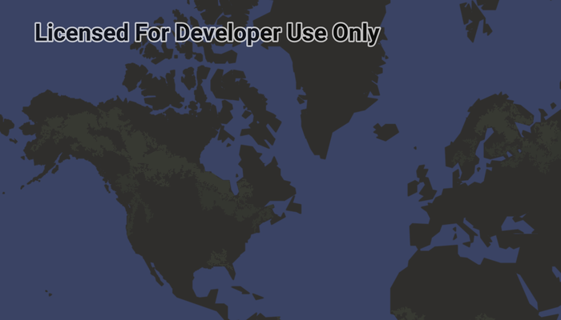

# Display Composable MapView

Display a map using Jetpack Compose.

## Use case

Android Jetpack Compose is designed to be more efficient and performant than XML layouts. It allows you to define UI in a more declarative and composable way. Compose is also designed to work seamlessly with Kotlin. Visit the Android doc, [why adopt Compose?](https://developer.android.com/jetpack/compose/why-adopt) to learn more.

## How to use the sample

Run the sample to view the map. Pan and zoom to navigate the map.

## How it works

1. Create a custom `@Composable` function to wrap the `MapView`
2. Use `AndroidView` to wrap a classic Android view in a Compose UI.
3. Set its `Modifier` to define the MapView layout parameters
4. Use its `factory` parameter to provide context and create `MapView(context)`
5. Add the `MapView` to the lifecycle observer
6. Add the composable content to the Activity using `setContent { }` 

## Relevant API

* ArcGISMap
* BasemapStyle
* MapView

## Additional information

This sample uses the GeoCompose Toolkit module to be able to implement a Composable MapView.

## Tags

basemap, compose, geocompose, jetpack, map, toolkit
