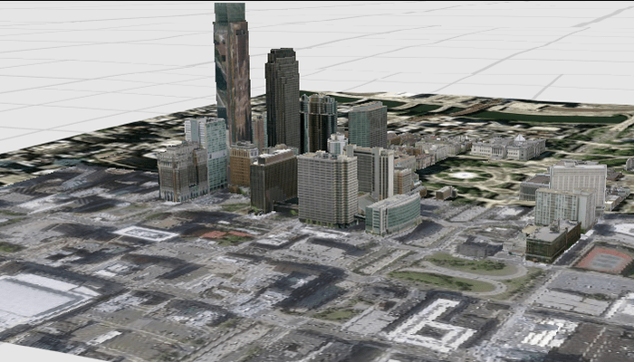

# Display scene from mobile scene package

Display a scene from a mobile scene package (.mspk)

## Use case

An .mspk file is an archive containing the data (specifically, basemaps and features), used to display an offline 3D scene.

## How to use the sample

When the sample opens, it will automatically display the Scene in the mobile scene package. Since this sample works with a local .mspk, you may initially need to download the file to your device. Pan and zoom to observe the scene from the mobile scene package.

## How it works

This sample takes a mobile scene package that was created in ArcGIS Pro, and displays a `Scene` from within the package in a `SceneView`.

1. Create a `MobileScenePackage` using the path to the local .mspk file.
2. Call `MobileScenePackage.load()` and check for any errors.
3. When the `MobileScenePackage` is loaded, obtain the first `Scene` from the `MobileScenePackage.scenes()` property.
4. Create a `SceneView` and call `SceneView.scene` to display the scene from the package.

## Relevant API

* ArcGISScene
* MobileScenePackage
* SceneView

## Additional information

This sample uses the GeoViewCompose Toolkit module to be able to implement a Composable MapView.

## Tags

3d, geoviewcompose, mobile scene package, mspk, offline, scene
