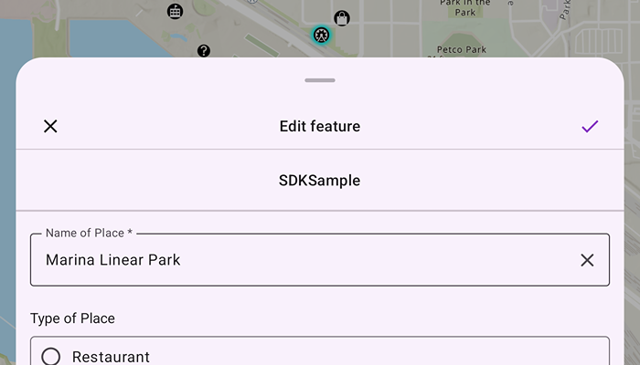

# Edit Feature Forms

Display and edit feature forms.

## Use case

TODO.

## How to use the sample

TODO.

## How it works

TODO.

## Relevant API

* ArcGISMap
* FeatureForm

## Additional information

This sample uses the GeoViewCompose Toolkit module to be able to implement a Composable MapView.

## Tags

basemap, compose, geoviewcompose, jetpack, map, toolkit
