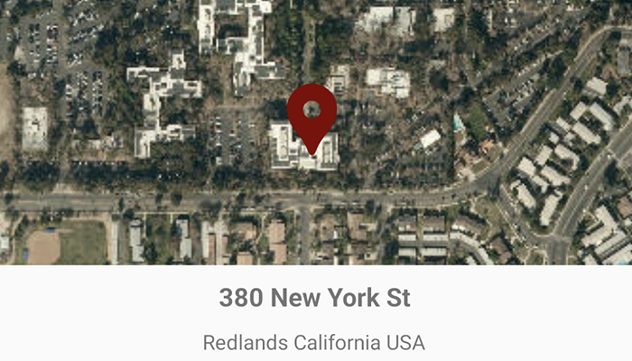

# Find address with reverse geocode

Use an online service to find the address for a tapped point.

## Use case

You might use a geocoder to find a customer's delivery address based on the location returned by their device's GPS.

## How to use the sample

Tap the map to see the nearest address displayed as a text view.

## How it works

1. Create a `LocatorTask` object using a URL to a geocoder service.
2. Get the matching results from the `GeocodeResult` using  `LocatorTask.reverseGeocode`.
3. Show the results using a `PictureMarkerSymbol` and add the symbol to a `Graphic` in the `GraphicsOverlay`.

## Relevant API

* GeocodeParameters
* GeocodeResult
* LocatorTask
* ReverseGeocodeParameters

## Additional information

This sample uses the World Geocoding Service. For more information, see the [Geocoding service](https://developers.arcgis.com/documentation/mapping-apis-and-services/search/services/geocoding-service/) help topic on the ArcGIS Developer website.

## Tags

address, geocode, locate, reverse geocode, search
