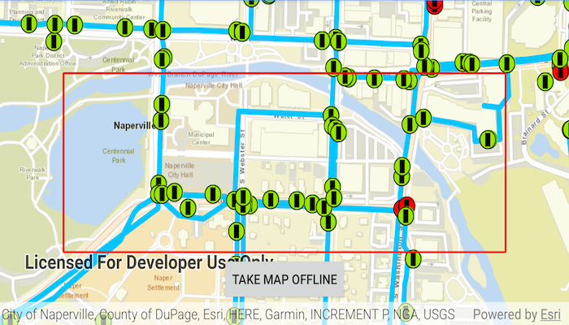

# Generate offline map using workmanager

Take a web map offline as a persistent background task

## Use case

Taking a web map offline allows users continued productivity when their network connectivity is poor or nonexistent. For example, by taking a map offline, a field worker inspecting utility lines in remote areas could still access a feature's location and attribute information.

## How to use the sample

Once the map loads, zoom to the extent you want to take offline. The red border shows the extent that will be downloaded. Tap the "Take Map Offline" button to start the offline map job. The progress bar will show the job's progress. When complete, the offline map will replace the online map in the map view. A notification is
also shown with the current job's progress along with a "Completed" or "Failure" notification when the job is done.
## How it works

1. Create an `ArcGISMap` with a `Portal` item pointing to the web map.
2. Create `GenerateOfflineMapParameters` specifying the download area geometry, minimum scale, and maximum scale.
3. Create an `OfflineMapTask` with the map.
4. Create the `OfflineMapJob` with `OfflineMapTask.generateOfflineMap(params, downloadDirectoryPath)`.
5. Serialize the `OfflineMapJob` to a file using `OfflineMapJob.toJson()`.
6. Create a new `OneTimeWorkRequest` with an instance of `OfflineJobWorker` and set its `inputData` to the `OfflineMapJob Json` filepath.
7. Use `WorkManager.enqueueUniqueWork()` to schedule the `OneTimeWorkRequest`.
8. When the `OneTimeWorkRequest` completes successfully, load the mobile map package from the `downloadDirectoryPath` with `mapPackage.load()`.
9. After it successfully loads, get the map and add it to the map view: `mapView.map = mapPackage.maps.first()`.

## WorkManager & Background behavior

The `OfflineJobWorker` is a `CoroutineWorker` instance which is run as a long-running foreground service by the `WorkManager`. See https://developer.android.com/guide/background/persistent/how-to/long-running for more info.

Hence the behavior of the Worker depends on state of the application as follows -

When the app

1. Moves into background 
   1. The download continues in the background and push notifications are sent.
2. Closed by swipe to kill
   1. The download continues in the background and push notifications are sent.
3. Force stopped or crashes
   1. The worker is killed and the download/notifications stop.
   2. The worker is restarted upon next launch.

## Notification behaviour

1. Progress push notification are posted when the `OfflineJobWorker` is running. 
2. Once the worker is done, either a "Completed" or "Failed" notification is posted.
3. Tapping on the notification takes you back into the app, while tapping on the "Completed" notification will also load the offline map.

## Relevant API

* GenerateOfflineMapJob
* GenerateOfflineMapParameters
* GenerateOfflineMapResult
* OfflineMapTask
* Portal

## About the data

The map used in this sample shows the [stormwater network](https://arcgisruntime.maps.arcgis.com/home/item.html?id=acc027394bc84c2fb04d1ed317aac674) within Naperville, IL, USA, with cartography designed for web and mobile devices with offline support.

## Additional information

The creation of the offline map can be fine-tuned using [parameter overrides for feature layers](https://github.com/Esri/arcgis-runtime-samples-android/tree/master/java/generate-offline-map-overrides), or by using [local basemaps](https://github.com/Esri/arcgis-runtime-samples-android/tree/master/java/generate-offline-map-with-local-basemap)
to achieve more customised results.

## Tags

download, offline, save, web map
