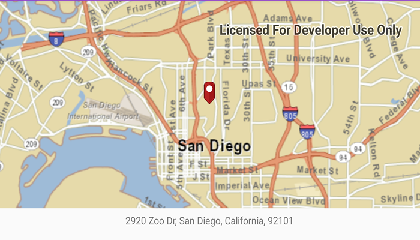

# Geocode offline

Geocode addresses to locations and reverse geocode locations to addresses offline.

## Use case

You can use an address locator file to geocode addresses and locations. For example, you could provide offline geocoding capabilities to field workers repairing critical infrastructure in a disaster when network availability is limited.

## How to use the sample

Type the address in the Search menu option or select from the list to `Geocode` the address and view the result on the map. Tap the location you want to reverse geocode. Select the pin to highlight the `PictureMarkerSymbol` (i.e. single tap on the pin).

## How it works

1. Use the path of a .loc file to create a `LocatorTask` object.
2. Set up `GeocodeParameters` and call `geocode` to get geocode results.
3. Call `reversegeocode` passing the tapped location on the map to find the address with reverse geocoding.

## Relevant API

* GeocodeParameters
* GeocodeResult
* LocatorTask
* ReverseGeocodeParameters

## Tags

geocode, geocoder, locator, offline, package, query, search
