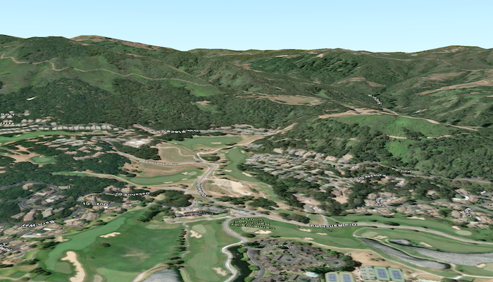

# Add elevation source from tile package

Set the terrain surface with elevation described by a local tile package.

## Use case

In a scene view, the terrain surface is what the basemap, operational layers, and graphics are draped onto. For example, when viewing a scene in a mountainous region, applying a terrain surface to the scene will help in recognizing the slopes, valleys, and elevated areas.

## How to use the sample

When loaded, the sample will show a scene with a terrain surface applied. Pan and zoom to explore the scene and observe how the terrain surface allows visualizing elevation differences.

## How it works

1. Create an `ArcGISScene` with a basemap style (for example, `ArcGISImagery`).
2. Create an `ArcGISTiledElevationSource` using the path to a local elevation tile package (.tpkx).
3. Create a `Surface` and add the elevation source to the surface's `elevationSources` collection.
4. Assign the `surface` to the scene's `baseSurface`.
5. Display the scene in a `SceneView` by passing the `ArcGISScene`.

## Relevant API

* ArcGISTiledElevationSource
* Surface

## Offline data

This sample uses the [Monterey Elevation](https://www.arcgis.com/home/item.html?id=52ca74b4ba8042b78b3c653696f34a9c) tile package, using CompactV2 storage format (.tpkx). It is downloaded from ArcGIS Online automatically.

## Additional information

The tile package must be a LERC (limited error raster compression) encoded TPK/TPKX. Details on can be found in the topic [Share a tile package](https://pro.arcgis.com/en/pro-app/help/sharing/overview/tile-package.htm) in the *ArcGIS Pro* documentation.

## Tags

3D, elevation, LERC, surface, terrain, tile cache
