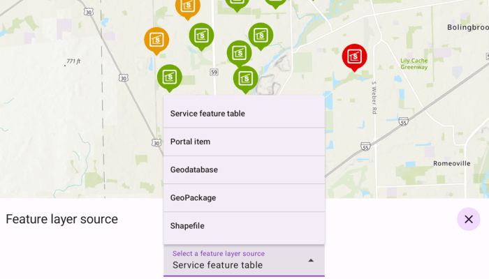

# Add feature layers

Add feature layers from various data sources.

## Use case

Feature layers, like other types of layers, visually represent data on a map or scene. For feature layers specifically, the data comes from a feature table or a feature service.

Feature services allow vector GIS data to be shared with different clients, enabling them to view, query, and edit individual features. These services can be accessed using both online and offline methods.

## How to use the sample

Tap the floating action button on the bottom right and select from the various sources to add feature layers to the map. Pan and zoom to explore the feature layers

## How it works

1. Create a new `ArcGISMap` object and pass it to the `MapView` composable's `arcGISMap` parameter.
2. Load a feature layer with a service feature table:
    * Create a `ServiceFeatureTable` using the service URL.
    * Create a `FeatureLayer` from the feature table.
3. Load a feature layer with a portal item:
    * Create a `PortalItem` with the portal and item ID.
    * Create a `FeatureLayer` from the portal item and ID.
4. Load a feature layer with a geodatabase:
    * Initialize and load a `Geodatabse` using a file name.
    * Retrieve the feature table from the geodatabase with the feature table's name.
    * Create a `FeatureLayer` from the feature table.
5. Load a feature layer with a geopackage:
    * Initialize and load the geopackage using a file name.
    * Get the first `GeoPackageFeatureTable` from the `geoPackageFeatureTables` list.
    * Create a `FeatureLayer` from the feature table.
6. Load a feature layer with a shapefile:
    * Create a `ShapefileFeatureTable` using the file path.
    * Create and load a `FeatureLayer` from the table.
7. In all cases, the selected feature layer is added to the map's operational layers.

## Relevant API

* FeatureLayer
* Geodatabase
* GeoPackageFeatureTable
* PortalItem
* ServiceFeatureTable
* ShapefileFeatureTable

## About the data

This sample uses the [Naperville damage assessment service](https://sampleserver7.arcgisonline.com/server/rest/services/DamageAssessment/FeatureServer/0), [Trees of Portland portal item](https://www.arcgis.com/home/item.html?id=1759fd3e8a324358a0c58d9a687a8578), [Los Angeles Trailheads geodatabase](https://www.arcgis.com/home/item.html?id=cb1b20748a9f4d128dad8a87244e3e37), [Aurora, Colorado GeoPackage](https://www.arcgis.com/home/item.html?id=68ec42517cdd439e81b036210483e8e7), and [Scottish Wildlife Trust Reserves Shapefile](https://www.arcgis.com/home/item.html?id=15a7cbd3af1e47cfa5d2c6b93dc44fc2).

The Scottish Wildlife Trust shapefile data is provided from Scottish Wildlife Trust under [CC-BY licence](https://creativecommons.org/licenses/by/4.0/). Data Copyright Scottish Wildlife Trust (2022).

## Tags

feature, geodatabase, geopackage, layers, portal, service, shapefile, table
