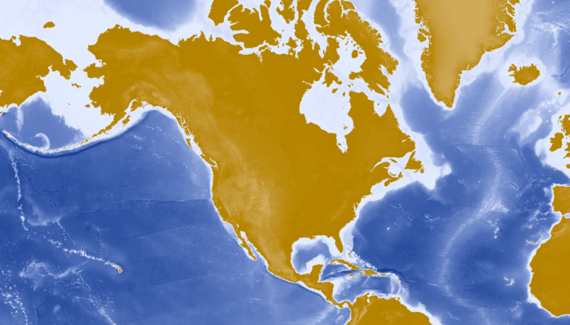

# Add map image layer

Display a layer from an ArcGIS map image layer service.

## Use case

Map image layers are also referred to as dynamic map services. These services generate images dynamically on the server and send the resulting image to the requesting client. This is useful when rendering complex cartography or large amounts of data in a connected environment, as the client simply displays the image that the server returns. This can result in more accurate and faster-performing layers.

## How to use the sample

Open the sample and view the map image layer. As you navigate the map, the layer issues image requests for the new map extent. The resulting images are rendered on the screen.

## How it works

1. Create an `ArcGISMap`.
2. Create an `ArcGISMapImageLayer` with the URL to a map image service.
3. Add the map image layer to the map's `operationalLayers`.
4. Display the map in a `MapView` composable.

## Relevant API

* ArcGISMap
* ArcGISMapImageLayer
* MapView (Compose Toolkit)

## Tags

display, image, layer, map
