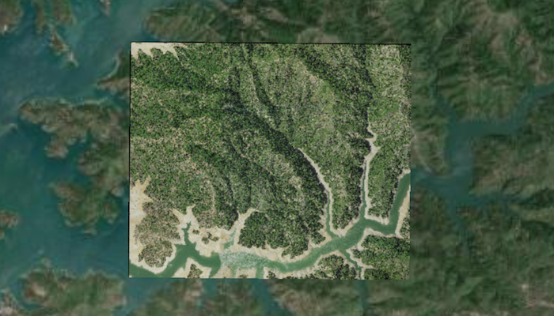

# Add raster from file

Create and use a raster layer made from a local raster file.

## Use case

Rasters can be digital aerial photographs, imagery from satellites, digital pictures, or even scanned maps. An end-user will frequently need to import raster files acquired through various data-collection methods into their map to view and analyze the data.

## How to use the sample

When the sample starts, a raster will be loaded from a file and displayed in the map view.

## How it works

1. Create a `Raster` from a raster file.
2. Create a `RasterLayer` from the raster.
3. Add it as an operational layer with `map.getOperationalLayers().add(rasterLayer)`.

## Relevant API

* Raster
* RasterLayer

## Additional information

See the topic [What is raster data?](http://desktop.arcgis.com/en/arcmap/10.3/manage-data/raster-and-images/what-is-raster-data.htm) in the *ArcMap* documentation for more information about raster images.

This sample uses the GeoView-Compose Toolkit module to be able to implement a Composable MapView.

## Tags

data, geoview-compose, image, import, layer, raster, toolkit, visualization
