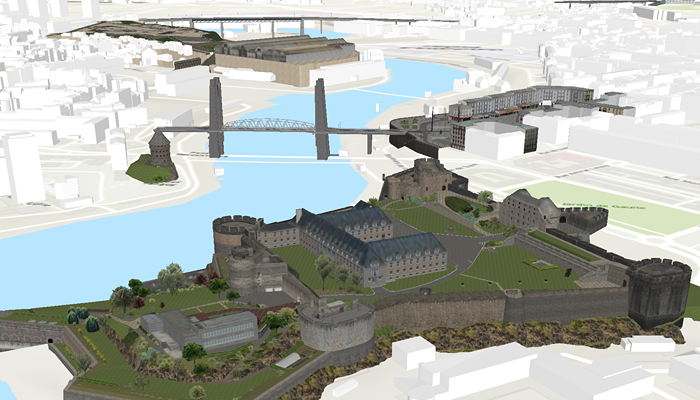

# Add scene layer with elevation

Add a scene layer to a scene.

## Use case

Each scene layer added to a scene can assist in performing helpful visual analysis. For example, if presenting the results of a shadow analysis of a major metropolitan downtown area in 3D, adding a scene layer of 3D buildings to the scene that could be toggled on/off would help to better contextualize the source of the shadows.

## How to use the sample

Run the sample to display a scene service with an `ArcGISSceneLayer`. Pan and zoom to explore the scene.

## How it works

1. Create an `ArcGISScene` having a `BasemapStyle.ArcGISTopographic`.
2. Create a `SceneView` and set the scene to the view.
3. Create an `ArcGISSceneLayer` using a data source URI: `ArcGISSceneLayer(Uri)`.
4. Add the new scene layer to the scene as an operational layer with `scene.operationalLayers.add(sceneLayer)`.

## Relevant API

* ArcGISScene
* ArcGISSceneLayer
* SceneView

## About the data

The scene launches with a northward view of the city of Brest, France ([SceneServer](https://tiles.arcgis.com/tiles/P3ePLMYs2RVChkJx/arcgis/rest/services/Buildings_Brest/SceneServer)). A 3D scene layer representing buildings (some textured) is used as an example.

## Additional information

This sample uses the GeoViewCompose Toolkit module to be able to implement a Composable SceneView.

## Tags

3D, geoviewcompose, layer, scene
