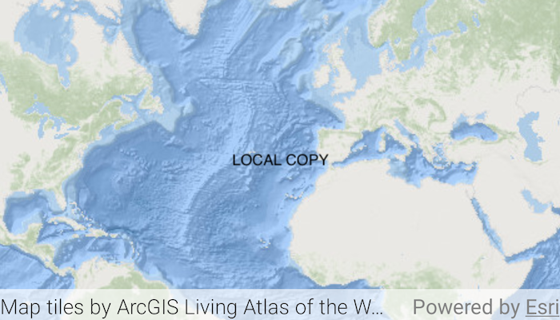

# Add web tiled layer

Display a web tiled layer.

## Use case

Tiled map services are a set of pre-generated images (e.g. "tiles") arranged in folders for each row, column, and zoom level. As you navigate the map, map tiles are requested for the current extent. `ArcGISTiledLayer` and `WmtsLayer` are types of tiled map services used for specific data types. `WebTiledLayer` is useful for displaying other data sources that contain tiles arranged in a row/column/level directory structure, such as OpenStreetMap.

## How to use the sample

Run the sample and a map will appear. As you navigate the map, map tiles will be fetched automatically and displayed on the map.

## How it works

1. Create a `WebTiledLayer` from a URL.
2. Set the `attribution` property on the web tiled layer. Note: this is a necessary step because web tiled services don't have associated service metadata.
3. Create a new `Basemap` from the layer and apply it to the mapView for display.

## Relevant API

* Basemap
* WebTiledLayer

## About the data

The basemap in this sample is provided by [ArcGIS Living Atlas of the World](https://www.arcgis.com/home/item.html?id=1e126e7520f9466c9ca28b8f28b5e500). ArcGIS Living Atlas of the World provides tiled services with several unique styles.

## Additional information

Web tiled services use a uniform addressing scheme with pre-rendered tiles. Image tiles are accessed via a URL template string, with parameters for subdomain, level, column, and row.

* Subdomain is optional and allows ArcGIS Maps SDK to balance requests among multiple servers for enhanced performance.
* Level, row, and column select the tiles to load based on the visible extent of the map.

This sample uses the GeoViewCompose Toolkit module to be able to implement a Composable MapView.

For more information about web tiled layers, see the following resources:

* [Wikipedia: tiled web maps](https://en.wikipedia.org/wiki/Tiled_web_map)
* [ArcGIS Pro: Share a web tile layer](http://pro.arcgis.com/en/pro-app/help/sharing/overview/web-tile-layer.htm)

## Tags

arcgis living atlas, geoviewcompose, layer, ogc, tiled, tiles, toolkit
