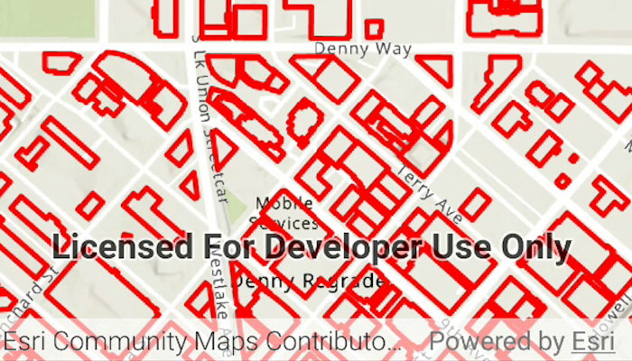

# Add WFS layer

Display a layer from a WFS service, requesting only features for the current extent.

## Use case

WFS is an open standard with functionality similar to ArcGIS feature services. ArcGIS Maps SDK support for WFS allows you to interoperate with open systems, which are often used in inter-agency efforts, like those for disaster relief.

## How to use the sample

Pan and zoom the map to see features within the current map extent. The WFS layer will be populated with features for the visible area whenever you stop navigating the map.

## How it works

1. Create a `WfsFeatureTable` with a service URL and table name.
2. Set the feature request mode to `ManualCache` and axis order to `NoSwap`.
3. Create a `FeatureLayer` from the WFS feature table and add it to the map's operational layers.
4. Listen for the `onVisibleAreaChanged` event to detect the visible map area, and for the `onNavigationChanged` event to detect when the user has stopped navigating.
5. When navigation ends, call `populateFromService(...)` on the WFS feature table, passing a query for the current visible extent.
6. Display a loading indicator while the WFS table is being populated.

## Relevant API

* FeatureLayer
* MapView.onNavigationChanged
* MapView.onVisibleAreaChanged
* WfsFeatureTable
* WfsFeatureTable.populateFromService

## About the data

This sample uses a WFS service showing building footprints for downtown Seattle. For more information, see the [ArcGIS Online item](https://www.arcgis.com/home/item.html?id=1b81d35c5b0942678140efc29bc25391).

## Tags

browse, catalog, feature, interaction cache, layers, OGC, service, web, WFS
