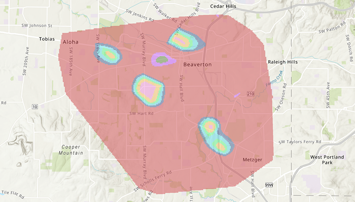

# Analyze hotspots

Use a geoprocessing service and a set of features to identify statistically significant hot spots and cold spots.

## Use case

This tool identifies statistically significant spatial clusters of high values (hot spots) and low values (cold spots). For example, a hotspot analysis based on the frequency of 911 calls within a set region.

## How to use the sample

Tap on Analyze, and select a date from the "FROM" DatePicker and "TO" DatePicker to get a date range from the BottomSheet and tap on Run analysis. The results will be shown on the map upon successful completion of the `GeoprocessingJob`.

## How it works

1. Create a `GeoprocessingTask` with the URL set to the endpoint of a geoprocessing service.
2. Create a query string with the date range as an input of `GeoprocessingParameters`.
3. Use the `GeoprocessingTask` to create a `GeoprocessingJob` with the `GeoprocessingParameters` instance.
4. Start the `GeoprocessingJob` and wait for it to complete and return a `GeoprocessingResult`.
5. Get the resulting `ArcGISMapImageLayer` using `GeoprocessingResult.mapImageLayer`.
6. Add the layer to the map's operational layers.

## Relevant API

* GeoprocessingJob
* GeoprocessingParameters
* GeoprocessingResult
* GeoprocessingTask

## Additional information

This sample uses the GeoView-Compose Toolkit module to be able to implement a Composable MapView.

## Tags

analysis, density, geoprocessing, geoview-compose, hot spots, hotspots, toolkit
