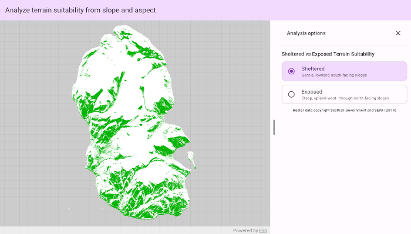

# Analyze terrain suitability from slope and aspect

Analyze terrain suitability from an elevation raster by deriving slope and aspect.

## Use case

Terrain suitability analysis is a common way to narrow a larger elevation surface down to areas that match a specific set of conditions. Slope and aspect are derived from elevation datasets to show how steep the terrain is and which direction it faces. Both of these factors can determine whether an area is suitable for a given purpose, for example, finding areas which are more sheltered from weather versus areas with more exposed terrain.

## How to use the sample

When the sample opens, the map shows the results of a preconfigured terrain suitability analysis which finds southward facing lowland slopes on the Isle of Arran, Scotland. The areas matching the criteria are rendered in green, and those not, in white. Open the settings panel to choose another preconfigured scenario, that of a west to north facing slope in upland terrains. Areas matching these criteria are rendered in purple.

## How it works

1. Create a `ContinuousField` from a raster file.
2. Create a `ContinuousFieldFunction` from the continuous field.
3. Derive a `slope` function and an `aspect` function from the continuous field function.
4. Create `BooleanFieldFunction` masks for slope, aspect, and elevation using range checks with map algebra.
5. Combine the masks using the infix `and` function and apply a land-only mask to exclude areas below sea level.
6. Create a `FieldAnalysis` from the resultant `BooleanFieldFunction`.
7. Apply a `ColormapRenderer` with a color for areas not matching the terrain suitability criteria, and a color for matching areas.
8. Add the analysis to an `AnalysisOverlay`.

## Relevant API

- AnalysisOverlay
- BooleanFieldFunction
- Colormap
- ColormapRenderer
- ContinuousField
- ContinuousFieldFunction
- FieldAnalysis

## About the data

The sample uses a [10m resolution digital terrain elevation raster of the Isle of Arran, Scotland](https://www.arcgis.com/home/item.html?id=aa97788593e34a32bcaae33947fdc271)
(Data Copyright Scottish Government and SEPA (2014)).

## Tags

aspect, elevation, field analysis, map algebra, raster, slope, spatial reference, terrain