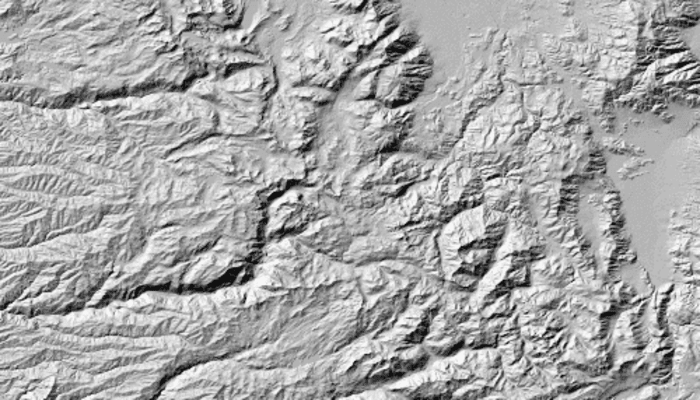

# Apply hillshade renderer to raster

Apply a hillshade renderer to a raster.

## Use case

To monitor coastal erosion, an environmental agency could analyze images of a specific area captured over a longer period of time while applying hillshade renderers for comparison.

## How to use the sample

Choose and adjust the settings to update the hillshade renderer on the raster layer. The sample allows you to change the Altitude, Azimuth, and Slope Type.

## How it works

1. Create a `Raster` from a grayscale raster file.
2. Create a `RasterLayer` from the raster.
3. Create a `Basemap` from the raster layer and set it to the map.
4. Create a `HillshadeRenderer`, specifying the slope type and other properties, `HillshadeRenderer.create(...)`.
5. Set the hillshade renderer to be used on the raster layer with `RasterLayer.renderer`.

## Relevant API

* Basemap
* HillshadeRenderer
* Raster
* RasterLayer

## Offline data

This sample downloads the [Hillshade raster](https://arcgis.com/home/item.html?id=ae9739163a76437ea02482e1a807b806) portal item from ArcGIS Online automatically.

## Tags

altitude, angle, azimuth, raster, slope, visualization
