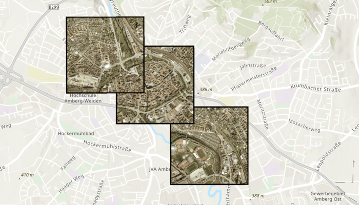

# Apply mosaic rule to rasters

Apply mosaic rules to a mosaic dataset of rasters.

## Use case

An image service can use a mosaic rule to mosaic multiple rasters on-the-fly. A mosaic rule can specify which rasters are selected, how the selected rasters are z-ordered, and how overlapping pixels from different rasters at the same location are resolved.

For example, when using the "byAttribute" mosaic method, the values in an attribute field are used to sort the images, and when using the "Center" method, the image closest to the center of the display is positioned as the top image in the mosaic. Additionally, the mosaic operator allows you to define how to resolve the overlapping cells, such as choosing a blending operation.

Specifying mosaic rules is useful for viewing overlapping rasters. For example, using the "By Attribute" mosaic method to sort the rasters based on their acquisition date allows the newest image to be on top. Using the "mean" mosaic operation makes the overlapping areas contain the mean cell values from all the overlapping rasters.

## How to use the sample

When the rasters are loaded, choose from a list of preset mosaic rules to apply to the rasters using the dropdown menu at the bottom of the screen. The map will update to display the rasters according to the selected rule.

## How it works

1. Create an `ImageServiceRaster` using the service's URL.
2. Create a `MosaicRule` object and set it to the `mosaicRule` property of the image service raster.
3. Create a `RasterLayer` from the image service raster and add it to the map.
4. Set the `mosaicMethod`, `mosaicOperation`, and other properties of the mosaic rule object accordingly to specify the rule on the raster dataset.

## Relevant API

* ImageServiceRaster
* MosaicMethod
* MosaicOperation
* MosaicRule
* RasterLayer

## About the data

This sample uses a [raster image service](https://sampleserver7.arcgisonline.com/server/rest/services/amberg_germany/ImageServer) that shows aerial images of Amberg, Germany.

## Additional information

The sample applies a hillshade function to a raster produced from the National Land Cover Database, [NLCDLandCover2001](https://sampleserver6.arcgisonline.com/arcgis/rest/services/NLCDLandCover2001/ImageServer). You can learn more about the [hillshade function](https://pro.arcgis.com/en/pro-app/latest/help/analysis/raster-functions/hillshade-function.htm) in the *ArcGIS Pro* documentation.

## Tags

image service, mosaic method, mosaic rule, raster
