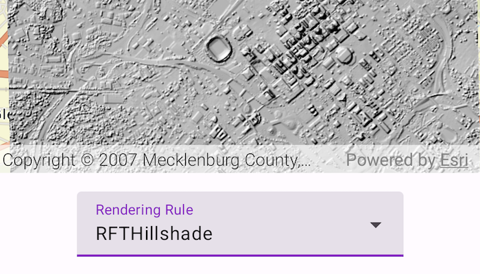

# Apply raster rendering rule

Display a raster on a map and apply different rendering rules to that raster.

## Use case

Raster images whose individual pixels represent elevation values can be rendered in a number of different ways, including representation of slope, aspect, hillshade, and shaded relief. Applying these different rendering rules to the same raster allows for a powerful visual analysis of the data. For example, a geologist could interrogate the raster image to map subtle geological features on a landscape, which may become apparent only through comparing the raster when rendered using several different rules.

## How to use the sample

Open the sample and use the picker to select a rendering rule.

## How it works

1. Create an `ImageServiceRaster` using a URL to an online image service.
2. After loading the raster, get its `serviceInfo` to get a list of `RenderingRuleInfo` supported by the service.
3. Choose a rendering rule info to apply and use it to create a `RenderingRule`.
4. Create a new `ImageServiceRaster` using the same image service URL.
5. Apply the rendering rule to the new raster.
6. Create a `RasterLayer` from the raster for display.

## Relevant API

* ImageServiceRaster
* RasterLayer
* RenderingRule

## About the data

The [CharlotteLAS image service](https://sampleserver6.arcgisonline.com/arcgis/rest/services/CharlotteLAS/ImageServer) contains 9 LAS files covering Charlotte, North Carolina's downtown area. The LiDAR data was collected in 2007. Four raster rules are available for selection: None, RFTAspectColor, RFTHillshade, and RFTShadedReliefElevationColorRamp.

## Additional information

Image service rasters of any type can have rendering rules applied to them; they need not necessarily be elevation rasters. See the list of [raster function objects](https://developers.arcgis.com/rest/services-reference/enterprise/raster-function-objects/) and syntax for rendering rules in the *ArcGIS REST API* documentation.

## Tags

raster, rendering rules, visualization
