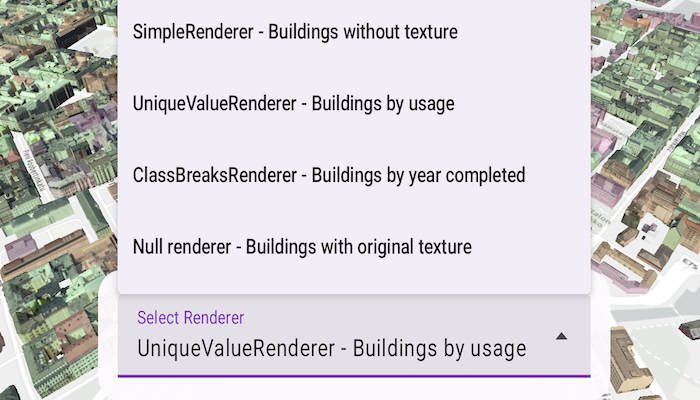

# Apply renderers to scene layer

Change the appearance of a 3D object scene layer with different renderers.

## Use case

A scene layer of 3D buildings hosted on ArcGIS Online comes with a preset renderer that defines how the buildings are displayed in the application. However, the fill color may sometimes blend into the basemap, making the buildings difficult to distinguish. To enhance visualization, you can apply a custom renderer with a more contrasting fill color, helping the 3D buildings stand out more clearly. Additionally, you can use a unique value renderer to represent different building uses, or a class breaks renderer to visualize building ages - valuable insights for urban planning and analysis.

## How to use the sample

Wait for the scene layer to load. The original scene layer displays 3D textured buildings. Tap on the "Select Renderer" dropdown menu and choose a different renderer to change how the buildings are visualized. Each renderer applies different symbology to the scene layer. Selecting a null renderer will remove any applied symbology, reverting the buildings to their original textured appearance.

## How it works

1. Create an `ArcGISSceneLayer` from a service URL.
2. Add the scene layer to an `ArcGISScene` and display it in a `SceneView`.
3. Create different renderers:
   * A `SimpleRenderer` with a `MultilayerMeshSymbol` and a fill color and edges.
   * A `UniqueValueRenderer` using a string field and different `MultilayerMeshSymbol` for each unique value of the building usage.
   * A `ClassBreaksRenderer` using a numeric field and different `MultilayerMeshSymbol` for each value range of year completed of the building.
4. Set the scene layer's `renderer` property to the selected renderer.
5. Set the scene layer's `renderer` property to `null`, resulting in displaying the original texture of the buildings.

## Relevant API

* ArcGISSceneLayer
* ClassBreaksRenderer
* MaterialFillSymbolLayer
* MultilayerMeshSymbol
* SceneView
* SimpleRenderer
* SymbolLayerEdges3D
* UniqueValueRenderer

## About the data

This sample displays a [Helsinki 3D buildings scene](https://www.arcgis.com/home/item.html?id=fdfa7e3168e74bf5b846fc701180930b) hosted on ArcGIS Online, showing 3D textured buildings in Helsinki, Finland.

## Tags

3D, buildings, renderer, scene layer, symbology, visualization
