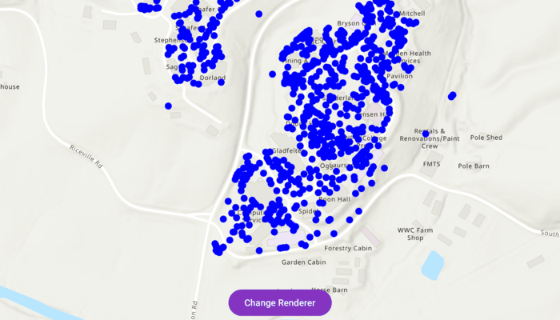

# Apply simple renderer to feature layer

Change the appearance of a feature layer with a renderer.

## Use case

A feature layer hosted on ArcGIS Online has a preset renderer and will display in an application with that renderer. However, for example, the color associated with the original renderer may be unsuitable for a company with staff or clients who are color blind, or for presentation with a different set of basemap and operational layers. In these cases, the renderer on the feature layer's data can be set to a more suitable color.

## How to use the sample

Use the button to change the renderer on the feature layer. The original renderer displays orange circles, the diameters of which are proportional to carbon storage of each tree. When the simple renderer is applied, it displays the location of the trees simply as points with random color.

## How it works

1. Create a `FeatureLayer` from a portal item.
2. Create a new renderer (in this case, a `SimpleRenderer`).
3. Change the feature layer's renderer.

## Relevant API

* FeatureLayer
* SimpleRenderer

## About the data

This sample displays a [Landscape Trees feature layer](https://arcgis.com/home/item.html?id=6d41340931544829acc8f68c27e69dec) in Warren Wilson College, North Carolina, showing carbon storage of trees on campus. The size of each circle is proportional to that particular tree's carbon storage total.

## Tags

feature layer, renderer, visualization
