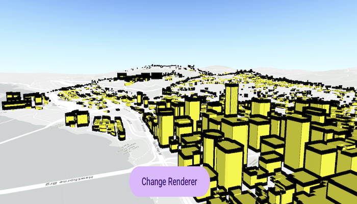

# Apply simple renderer to scene layer

Change the appearance of a scene layer with a renderer.

## Use case

A scene layer hosted on ArcGIS Online has a preset renderer and will display in an application with that renderer. However, for example, the color associated with the original renderer may be unsuitable for a company with staff or clients who are color blind, or for presentation with a different set of basemap and operational layers. In these cases, the renderer on the scene layer's data can be set to a more suitable color.

## How to use the sample

Use the button to change the renderer on the scene layer. The original renderer displays the buildings with their default symbology. When the simple renderer is applied, it displays the buildings with a random color.

## How it works

1. Create an `ArcGISSceneLayer` from a service URL.
2. Add the scene layer to an `ArcGISScene` and display it in a `SceneView`.
3. Create a `MultilayerMeshSymbol` with a random color.
4. Create a `SimpleRenderer` using the mesh symbol.
5. Set the scene layer's `renderer` property to the new renderer.

## Relevant API

* ArcGISSceneLayer
* SimpleRenderer
* MultilayerMeshSymbol
* SceneView

## About the data

This sample displays a [Portland, Oregon USA Scene](https://www.arcgis.com/home/item.html?id=2b721b9e7bef45e2b7ff78a398a33acc) hosted on ArcGIS Online, showing 3D buildings in downtown Portland.

## Tags

3D, buildings, renderer, scene, symbology, visualization