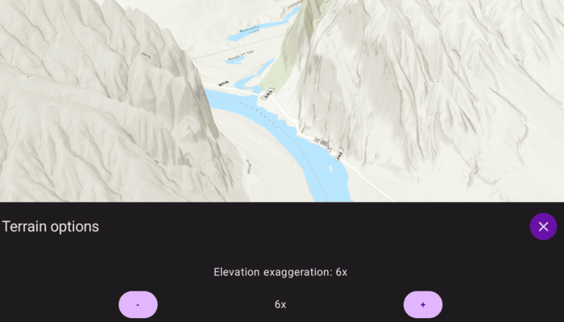

# Apply terrain exaggeration

Vertically exaggerate terrain in a scene.

## Use case

Vertical exaggeration is useful when the horizontal extent of a landscape is much larger than the vertical relief. Exaggerating elevation makes small terrain variations more visible, which is helpful for visualizations, presentations, and exploratory analysis.

## How to use the sample

Open the sample to display a SceneView centered on a location with elevation data. Use the "+" and "-" buttons in the bottom sheet to increase or decrease the terrain vertical exaggeration. The UI shows the current exaggeration factor (1x to 10x).

## How it works

1. Create an `ArcGISTiledElevationSource` that points to a terrain ImageServer.
    - An elevation source defines the terrain based on a digital elevation model (DEM) or digital terrain model (DTM). 
2. Add the elevation source to a `Surface` and assign that surface to a Scene's `baseSurface`.
3. Configure the surface's `elevationExaggeration` using a multiplier factor.

## Relevant API

* baseSurface
* elevationExaggeration
* Scene
* Surface

## Tags

3D, DEM, elevation, exaggeration, scene, surface, terrain
