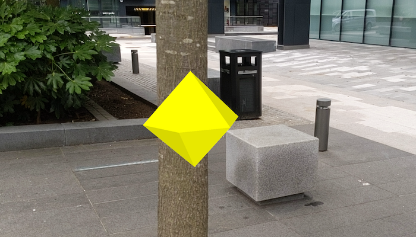

# Augment reality to collect data

Tap on real-world objects to collect data.

## Use case

You can use AR to quickly photograph an object and automatically determine the object's real-world
location, facilitating a more efficient data collection workflow. For example, you could quickly
catalog trees in a park, while maintaining visual context of which trees have been
recorded - no need for spray paint or tape.

## How to use the sample

Before you start, go through the on-screen calibration process to ensure accurate positioning
of recorded features.

When you tap, an yellow diamond will appear at the tapped location. You can move around to
visually verify that the tapped point is in the correct physical location. When you're
satisfied, tap the '+' button to record the feature.

## How it works

1. Add a `WorldScaleSceneView` composable to the augmented reality screen, available in the [ArcGIS Maps SDK for Kotlin toolkit](https://github.com/Esri/arcgis-maps-sdk-kotlin-toolkit/tree/main/microapps/ArWorldScaleApp).
    * The component is available both in `World tracking` and `Geospatial tracking` modes. Geospatial tracking uses street view data to calibrate augmented reality positioning and is available with an [ARCORE API key](https://developers.google.com/ar/develop/authorization?platform=android#api-key-android).
2. Load the feature service, create feature layer and add it to the scene.
3. Create and add the elevation surface to the scene.
4. Create a graphics overlay for planning the location of features to add and add it to the scene.
5. Use the `onSingleTapConfirmed` lambda parameter on the `WorldScaleSceneView` to detect when the user taps and get the real-world location of the point they tapped using ARCore's Depth API.
6. Add a graphic to the graphics overlay preview where the feature will be placed and allow the user to visually verify the placement.
7. Prompt the user for a tree health value, then create the feature.

## Relevant API

* GraphicsOverlay
* SceneView
* Surface
* WorldScaleSceneView

## About the data

The sample uses a publicly-editable sample tree survey feature service hosted on ArcGIS Online
called [AR Tree Survey](https://arcgisruntime.maps.arcgis.com/home/item.html?id=8feb9ea6a27f48b58b3faf04e0e303ed).
You can use AR to quickly record the location and health of a tree.

## Additional information

This sample requires a device that is compatible with [ARCore](https://developers.google.com/ar/devices).

The `onSingleTapConfirmed` lambda parameter to the `WorldScaleSceneView` passes a `mapPoint` parameter when it is able to determine the real-world location of the tapped point. On devices that support [ARCore's Depth API](https://developers.google.com/ar/develop/depth#device_compatibility), this point is represents the closest visible object to the device at the tapped screen point in the camera feed. On devices that do not support the Depth API, ARCore will attempt to perform a [hit test](https://developers.google.com/ar/develop/hit-test) against any planes that were detected in the scene at that location. If no planes are detected, then `mapPoint` will be null.

Note that the `WorldScaleSceneViewProxy` also supports converting screen coordinates to scene points using `WorldScaleSceneViewProxy.screenToBaseSurface()` and `WorldScaleSceneViewProxy.screenToLocation()`. However, these methods will test the screen coordinate against virtual objects in the scene, so real-world objects that do not have geometry (ie. a mesh) will not be used for the calculation. Therefore, `screenToBaseSurface()` and `screenToLocation()` should only be used where the developer is sure that the data contains geometry for the real-world object in the camera feed.

This sample uses the `onSingleTapConfirmed` lambda, as it is the only way to get accurate positions for features present in the real-world but not present in the scene, such as trees.

Note that unlike other scene samples, a basemap isn't shown most of the time, because the real
world provides the context. Only while calibrating is the basemap displayed at 50% opacity, to
give the user a visual reference to compare to.

**World-scale AR** is one of three main patterns for working with geographic information in augmented
reality currently available in the [toolkit](https://github.com/Esri/arcgis-maps-sdk-kotlin-toolkit/tree/main).

Note that apps using ARCore must comply with ARCore's user privacy requirements.
See [this page](https://developers.google.com/ar/develop/privacy-requirements) for more information.

See the 'Edit feature attachments' sample for more specific information about the attachment editing workflow.

## Tags

attachment, augmented reality, capture, collection, collector, data, field, field worker, full-scale, mixed reality, survey, world-scale
