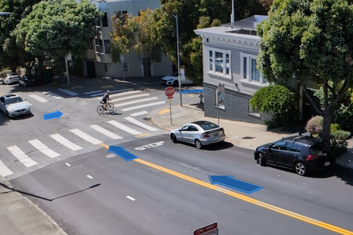

# Augment reality to navigate route

Use a route displayed in the real world to navigate.

## Use case

It can be hard to navigate using 2D maps in unfamiliar environments. You can use full-scale AR to show a route overlaid on the real-world for easier navigation.

## How to use the sample

The app opens with a map centered on your current location. Tap the map or use your current location to set a start point and a destination. The route will be calculated and displayed as a line. Tap the "Navigate in augmented reality" button. Follow the route displayed in the AR view. Directions will be provided as you progress.

## How it works

1. The map page is used to plan the route before starting navigation in augmented reality. See the *Find route* sample for a more focused demonstration of that workflow.
2. Pass the resulting `Route` to the augmented reality view model used to augment reality with navigation information.
3. Add a `WorldScaleSceneView` composable to the augmented reality screen, available in the [ArcGIS Maps SDK for Kotlin toolkit](https://github.com/Esri/arcgis-maps-sdk-kotlin-toolkit/tree/main/microapps/ArWorldScaleApp).
    * The component is available both in `World tracking` and `Geospatial tracking` modes. Geospatial tracking uses street view data to calibrate augmented reality positioning and is available with an [ARCORE API key](https://developers.google.com/ar/develop/authorization?platform=android#api-key-android).
4. Get a list of `DirectionManeuver`s from the `Route` (solved in 2D) and add z values to the route's geometry using Esri's `ElevationSource.fromTerrain3dService()`.
5. Using heading and pitch information calculated from one point to the next, create a `ModelSceneSymbol` `Graphic` oriented towards then next point.
    * Arrows that represent a turn are also given a roll of 90 to stand upright and animated for greater visibility.
6. Create a `RouteTracker` to track the user's location and provide navigation instructions.
7. On location updates from the `RouteTracker`, determine the closest arrow `Graphic` to the user's location and change the graphic's behind the user to be partly opaque.
8. A UI slider adjusts the number of the arrow `Graphic`s drawn ahead of the user. Too many graphics can clutter the UI and be confusing when shown behind real world objects.
9. A calibration view is provided by the `WorldScaleSceneView` to adjust the heading of the camera when in `World tracking` mode.

## Relevant API

* LocationDataSource
* ModelSceneSymbol
* RouteResult
* RouteTask
* RouteTracker
* Surface
* WorldScaleSceneView

## About the data

This sample uses Esri's [world elevation service](https://elevation3d.arcgis.com/arcgis/rest/services/WorldElevation3D/Terrain3D/ImageServer) to ensure that route lines are placed appropriately in 3D space. It uses Esri's [world routing service](https://www.arcgis.com/home/item.html?id=1feb41652c5c4bd2ba5c60df2b4ea2c4) to calculate routes. The world routing service requires an API key and does consume ArcGIS Online credits.

## Additional information

This sample requires a device that is compatible with [ARCore](https://developers.google.com/ar/devices).

Unlike other scene samples, there's no need for a basemap while navigating, because context is provided by the camera feed showing the real environment. The base surface's opacity is set to zero to prevent it from interfering with the AR experience.

**World-scale AR** is one of two main patterns for working with geographic information in augmented reality currently available in the [toolkit](https://github.com/Esri/arcgis-maps-sdk-kotlin-toolkit/tree/main).

## Tags

augmented reality, directions, full-scale, guidance, mixed reality, navigate, navigation, real-scale, route, routing, world-scale
