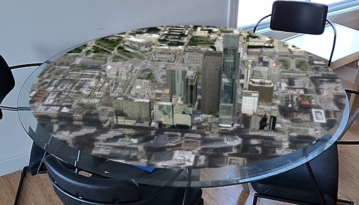

# Augment reality to show tabletop scene

Use augmented reality (AR) to pin a scene to a table or desk for easy exploration.

## Use case

Tabletop scenes allow you to use your device to interact with scenes as if they are 3D-printed model models sitting on your desk. You could use this to virtually explore a proposed development without needing to create a physical model.

## How to use the sample

Once the scene loads, you'll see a feed from the camera. Wait for ArCore to highlight a plane and tap on one to place the scene. With the scene placed, you can move the camera around the scene to explore.

NOTE: [Google Play Services for AR](https://play.google.com/store/apps/details?id=com.google.ar.core) must be installed to run this app.

## How it works

1. Create a `TableTopSceneView` with `anchorPoint`, `translationFactor`, `clippingDistance`, and a `scene`.
2. For this sample, the `anchorPoint` sets coordinates at the center of the buildings in the `ArcGSISceneLayer` to give the impression that the scene is centered on the location the user tapped.
3. Set the `translationFactor` such that the user can view the entire scene by moving the device around it. The translation factor defines how far the virtual camera moves through the scene when the physical camera moves.
   -A good formula for determining translation factor to use in a tabletop map experience is translationFactor = sceneWidth / tableTopWidth. The scene width is the width/length of the scene content you wish to display in meters. The tabletop width is the length of the area on the physical surface that you want the scene content to fill. For simplicity, the sample assumes a scene width of 800 meters.
4. Set the `clippingDistance` to clip the scene to the area you want to show.

## Relevant API

* ArcGISScene
* TableTopSceneView

## About the data

This sample uses the [Philadelphia Mobile Scene Package](https://www.arcgis.com/home/item.html?id=7dd2f97bb007466ea939160d0de96a9d). It was chosen because it is a compact scene ideal for tabletop use. Note that tabletop mapping experiences work best with small, focused scenes. The small, focused area with basemap tiles defines a clear boundary for the scene.

## Additional information

This sample requires a device that is compatible with ARCore on Android.

This sample uses [AR from the Maps SDK Toolkit](https://github.com/Esri/arcgis-maps-sdk-kotlin-toolkit/tree/main/toolkit/ar). 

## Tags

augmented reality, drop, mixed reality, model, pin, place, table-top, tabletop
