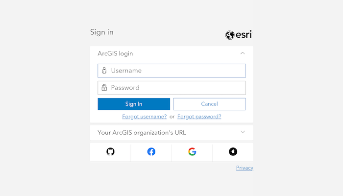

# Authenticate with OAuth

Authenticate with ArcGIS Online (or your own portal) using OAuth2 to access secured resources (such as private web maps or layers). Accessing secured items requires logging in to the portal that hosts them (an ArcGIS Online account, for example).



## Use case

Your app may need to access items that are only shared with authorized users. For example, your organization may host private data layers or feature services that are only accessible to verified users. You may also need to take advantage of premium ArcGIS Online services, such as geocoding or routing services, which require a named user login.

## How to use the sample

When you run the sample, the app will load a web map which contains premium content. You will be challenged for an ArcGIS Online login to view the private layers. Enter a user name and password for an ArcGIS Online named user account (such as your ArcGIS for Developers account). If you authenticate successfully, the traffic layer will display, otherwise the map will contain only the public basemap layer.

## How it works

1. Create an `AuthenticatorState` and set the `OAuthConfiguration` with the portal URL, client ID, and redirect URI.
2. Call the toolkit's `DialogAuthenticator` composable at the top level of your view hierarchy and pass the `AuthenticatorState` object. Because the `AuthenticatorState` object has an `OAuthConfiguration` set, the `DialogAuthenticator` will prompt for OAuth credentials when the associated `Portal` is loaded.
3. Load a `PortalItem(...)` with connection type `Portal.Connection.Authenticated` which will issue an authentication challenge.
4. Configure the manifest.xml to handle the OAuth redirect URI.
   * Define a second activity in the `manifest.xml` with the name `AuthenticationActivity` from the toolkit

   ```xml
   <activity
        android:name="com.arcgismaps.toolkit.authentication.AuthenticationActivity"
        android:launchMode="singleTop"> <!--keeps only one instance to the top of the stack-->
   ```

   * Set the `<intent-filter>` categories tags to be able to launch a custom browser tab.

   ```xml
   <intent-filter>
        <action android:name="android.intent.action.VIEW" />
        <!--required to launch a custom browser tab-->
        <category android:name="android.intent.category.DEFAULT" />
        <category android:name="android.intent.category.BROWSABLE" />
   ```

   * Set the `data` and `host` tags to be able to use the redirect URI to navigate back to the app after prompting for OAuth credentials.

   ```xml
   <data
        android:host="auth"
        android:scheme="my-ags-app" />
   ```

To learn more on setting up the data specification to an intent filter, visit the [Android docs](https://developer.android.com/guide/topics/manifest/data-element).

## Relevant API

* ArcGISAuthenticationChallengeHandler
* ArcGISAuthenticationChallengeResponse
* AuthenticationManager
* AuthenticatorState
* DialogAuthenticator
* OAuthUserConfiguration
* PortalItem

## Additional information

This sample uses the toolkit's [authentication](https://github.com/Esri/arcgis-maps-sdk-kotlin-toolkit/tree/main/toolkit/authentication#authenticator) module to handle authentication. For information about setting up the toolkit, as well as code for the underlying component, visit the [toolkit docs](https://developers.arcgis.com/kotlin/toolkit/).

The workflow presented in this sample works for all SAML based enterprise (IWA, PKI, Okta, etc.) & social (facebook, google, etc.) identity providers for ArcGIS Online or Portal. For more information, see the topic [Set up enterprise logins](https://doc.arcgis.com/en/arcgis-online/administer/enterprise-logins.htm).

For additional information on using Oauth in your app, see the topic [Authenticate with the API](https://developers.arcgis.com/documentation/core-concepts/security-and-authentication/mobile-and-native-user-logins/) in *Mobile and Native Named User Login*.

For more information on how OAuth works visit [OAuth 2.0 with ArcGIS](https://developers.arcgis.com/documentation/mapping-apis-and-services/security/oauth-2.0/)

## Tags

authentication, cloud, credential, OAuth, portal, security, toolkit
