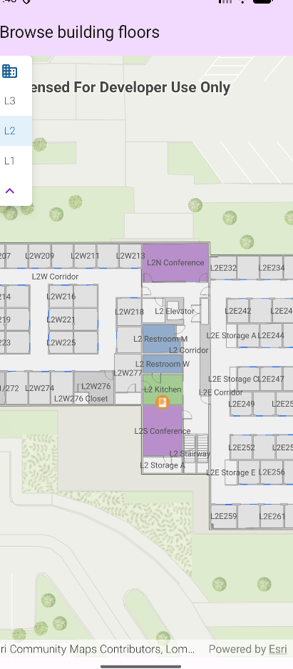

# Browse building floors

Display and browse through building floors from a floor-aware web map.

## Use case

Having map data to aid indoor navigation in buildings with multiple floors such as airports, museums, or offices can be incredibly useful. For example, you may wish to browse through all available floor maps for an office in order to find the location of an upcoming meeting in advance.

## How to use the sample

Use the spinner to browse different floor levels in the facility. Only the selected floor will be displayed.

## How it works

1. Create a `PortalItem` using the `itemId` of the floor-aware web map, and use it to create an `ArcGISMap`.
2. Create a `FloorFilterState`, passing it the map as its `geoModel`, and configure its `UIProperties` (e.g. `maxDisplayLevels`, `closeButtonPosition`).
3. Display the map in a `MapView`.
4. Display a `FloorFilter` composable over the `MapView`, passing it the `FloorFilterState`, to let the user browse and switch between the map's floors.

## Relevant API

* FloorManager

## About the data

This sample uses a [floor-aware web map](https://www.arcgis.com/home/item.html?id=f133a698536f44c8884ad81f80b6cfc7) that displays the floors of Building L on the Esri Redlands campus.

## Additional information

The API also supports browsing different sites and facilities in addition to building floors.

## Tags

building, facility, floor, floor-aware, floors, ground floor, indoor, level, site, story
