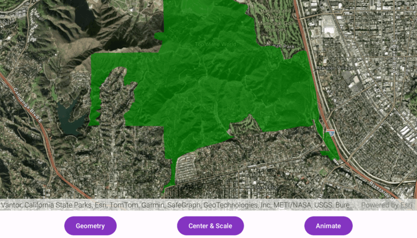

# Change viewpoint

Set the map view to a new viewpoint.

## Use case

Navigate programmatically to a specific location on the map, allowing you to zoom in on a particular
point.

## How to use the sample

The map opens centered on London with an imagery basemap. Tap "Geometry" to jump the viewpoint to a
polyline extent near Westminster, tao "Center" to instantly center the map on Waterloo at a set
scale, or tap "Animate" to smoothly pan back to London over seven seconds.

## How it works

1. Create a new `ArcGISMap` object and pass it to the `MapView` composable's `arcGISMap` parameter.
2. Change the map's `Viewpoint` by calling one of the available methods on your `MapViewProxy`:
    * Use `MapViewProxy.setViewpointAnimted()` to pan to a viewpoint over a specified `Duration`.
    * Use `MapViewProxy.setViewpointCenter()` to center the viewpoint on a `Point`.
    * Use `MapViewProxy.setViewpointGeometry()` to set a viewpoint on a given `Geometry`

## Relevant API

* ArcGISMap
* Geometry
* MapViewProxy
* Point
* Viewpoint

## Tags

animate, center, scale, view, zoom
