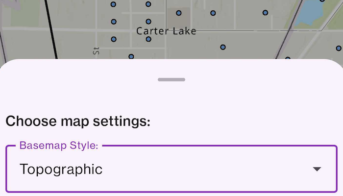

# Create and save map

Create and save a map as a web map item to an ArcGIS portal.

## Use case

Maps can be created programmatically in code and then serialized and saved as an ArcGIS portal item. In this case, the portal item is a web map which can be shared with others and opened in various applications and APIs throughout the platform, such as ArcGIS Pro, ArcGIS Online, the JavaScript API, Collector, and Explorer.

## How to use the sample

When you run the sample, you will be challenged for an ArcGIS Online login. Enter a username and password for an ArcGIS Online named user account (such as your ArcGIS for Developers account). Then, tap the Edit Map button to choose the basemap and layers for your new map. To save the map, add a title, tags and description (optional), and a folder on your portal (you will need to create one in your portal's My Content section if you don't already have one). Click the Save to Account button to save the map to the chosen folder.

## How it works

1. Configure an `AuthenticatorState` to handle authentication challenges.
2. Add the `AuthenticatorState` to a `DialogAuthenticator` in the app's `MainActivity` to invoke the authentication challenge.
3. Create a new `Portal` and load it.
4. Access the `PortalUserContent` with `portal.portalInfo?.user?.fetchContent()?.onSuccess`, to get the user's list of portal folders with `portalUserContent.folders`.
5. Create an `ArcGISMap` with a `BasemapStyle` and a few operational layers.
6. Call `ArcGISMap.saveMap()` to save a new `ArcGISMap` with the specified title, tags, and folder to the portal.

## Relevant API

* ArcGISMap
* Portal

## Additional information

This sample uses the GeoView-Compose Toolkit module to be able to implement a Composable MapView.

## Tags

ArcGIS Online, ArcGIS Pro, geoview-compose, portal, publish, share, web map
