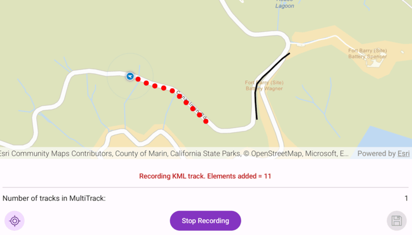

# Create KML multi track

Create a KML multi-track by recording simulated location data, then save and preview your recorded hiking paths.

## Use case

When you are hiking along a trail, it can be useful to record your path and share it later as a KML file. You might also want to capture multiple tracks in one trip. This sample demonstrates how you can collect individual KML tracks during a navigation session, then combine and export them as a single KML multi-track.

## How to use the sample

Tap **Start Navigation** to begin moving along a simulated trail. Tap **Record Track** to start recording your current path. Tap **Stop Recording** to end recording. Repeat steps to capture multiple KML tracks in a single session. Tap **Save** button to save your recorded tracks as a `.kmz` file to local storage. Then review tracks to load and display the created `.kmz` file containing your KML multi-track.

## How it works

1. Use an `ArcGISMap` to display a basemap and a path geometry for your navigation route.  
2. Create a simulated location data source (`SimulatedLocationDataSource`) to drive the `LocationDisplay`.  
3. As you receive `Location` updates, add each point to a list of `KmlTrackElement` objects while recording.  
4. Combine one or more `KmlTrack` objects into a `KmlMultiTrack`.  
5. Save the `KmlMultiTrack` inside a `KmlDocument`, then export the document to a `.kmz` file.  
6. Load the saved `.kmz` file into a `KmlDataset` to preview your tracks on the map.

## Relevant API

- ArcGISMap  
- KmlDataset  
- KmlDocument  
- KmlMultiTrack  
- KmlPlacemark  
- KmlTrack  
- LocationDisplay  
- SimulatedLocationDataSource  

## Additional information

This sample uses the GeoView-Compose Toolkit module to be able to implement a composable SceneView.

## Tags

export, geoview-compose, mutli-track, kmz, hiking, kml, record, track
