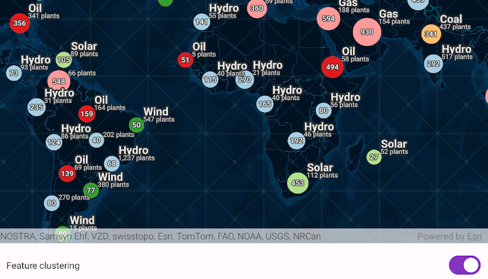
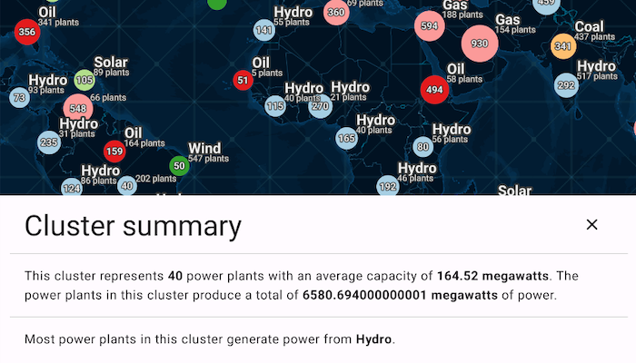

# Display clusters

Display a web map with a point feature layer that has feature reduction enabled to aggregate points into clusters.

Map displaying the feature layer with feature reduction property enabled by default:

Popup message displaying the cluster details:

## Use case

Feature clustering can be used to dynamically aggregate groups of points that are within proximity of each other in order to represent each group with a single symbol. Such grouping allows you to see patterns in the data that are difficult to visualize when a layer contains hundreds or thousands of points that overlap and cover each other.

## How to use the sample

Pan and zoom the map to view how clustering is dynamically updated. Disable clustering to view the original point features that make up the clustered elements. When clustering is On, you can click on a clustered geoelement to view aggregated information and summary statistics for that cluster. When clustering is toggled off and you click on the original feature you get access to information about individual power plant features.

## How it works

1. Create a map from a web map `PortalItem`.
2. Get the cluster enabled layer from the map's operational layers.
3. Get the `FeatureReduction` from the feature layer and set `isEnabled` value to enable or disable clustering on the feature layer.
4. When the user clicks on the map, call `identifyLayers` and pass in the map's screen coordinates.
5. Get the `Popup` and the corresponding `PopupElement` from the resulting `IdentifyLayerResult` and use it to construct a popup output string.
6. Use `Html.fromHtml` to convert the html tags in the output string to a styled text and display it to the user.

## Relevant API

* FeatureLayer
* FeatureReduction
* IdentifyLayerResult
* Popup
* PopupElement
* PopupField
* Portal
* PortalItem

## About the data

This sample uses a [web map](https://www.arcgis.com/home/item.html?id=8916d50c44c746c1aafae001552bad23) that displays the Esri [Global Power Plants](https://www.arcgis.com/home/item.html?id=eb54b44c65b846cca12914b87b315169) feature layer with feature reduction enabled. When enabled, the aggregate features symbology shows the color of the most common power plant type, and a size relative to the average plant capacity of the cluster.

## Additional information

This sample uses the GeoView-Compose Toolkit module to be able to implement a Composable MapView.

## Tags

aggregate, bin, cluster, geoview-compose, group, merge, normalize, reduce, summarize, toolkit
