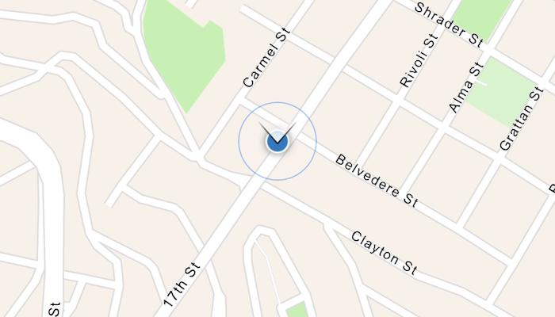

# Display device location with fused location data source

This sample demonstrates how to use the [Fused Location Provider](https://developers.google.com/location-context/fused-location-provider) and [Fused Orientation Provider](https://android-developers.googleblog.com/2024/03/introducing-fused-orientation-provider-api.html) to implement an ArcGIS Maps SDK Custom Location Data Source Location Provider.

## Use case

The fused location provider can provide more accurate location information than a single location provider. It uses GPS, Wi-Fi, and cell network data to determine the device's location. In urban areas, it can also use 3D building data in urban areas to improve GPS accuracy.

## How to use the sample

Start the sample and allow the app to access your device's location. The sample will display your location on the map. Use the priority and interval settings to change the location provider's behavior. Note the change in the location display when changing these settings--namely the change in rate at which the expanding blue ring animation triggers (which signifies an updated location).

## How it works

1. Implement the `CustomLocationDataSource.LocationProvider` interface overriding the `headings` and `locations` flows.
2. Create a `FusedLocationProviderClient` and `FusedOrientationProviderClient` to get the device's location and orientation.
3. Using the clients, request location updates and orientation updates and emit their values into the `locations` and `headings` flows. The function `createArcGISLocationFromFusedLocation(...)` is used to convert a fused `Location` object to an `ArcGISLocation` object.
4. Create a `LocationDisplay` with `rememberLocationDisplay()` and set it to the composable `MapView`.
5. Set the `LocationDisplay` data source to a `CustomLocationDataSource` which implements the `LocationProvider` interface.

## Relevant API

* CustomLocationDataSource
* Location
* LocationDataSource
* LocationDisplay
* LocationProvider

## Additional information

The fused location and orientation APIs are part of Google Play Services. The fused location provider intelligently combines different signals like GPS and Wi-Fi to provide the location information. The fused orientation provider is a new API that provides a way to access orientation information on Android devices.

## Tags

cell, fused, GPS, headings, locations, orientation, Wifi
