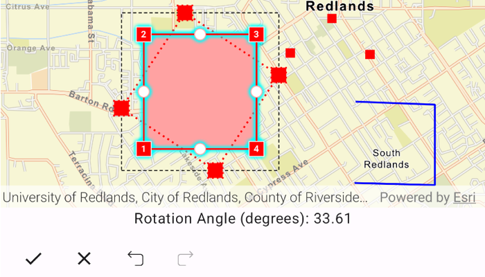

# Display geometry editor information during interaction

See information about the previewed geometry during an interaction using the geometry editor.

## Use case

The geometry editor can provide information about the geometry being created or edited during an interaction. This information can be used to give feedback to the user to show the effect of the interaction on the geometry.

## How to use the sample

Tap a graphic to edit its geometry by moving, rotating, or scaling the geometry. During the interaction, information about the changes will be displayed to provide feedback to the user.

Use the buttons in the settings view to undo or redo changes made to the geometry. Use the cancel and done buttons to discard and save changes.

## How it works

1. Create a `MapViewProxy` for interacting with the composable `MapView`.
2. Create a composable `MapView` and pass in the `mapViewProxy` and `geometryEditor` (for example, `MapView(mapViewProxy = mapViewProxy, geometryEditor = geometryEditor, ...)`).
3. Add an event handler to listen to `GeometryEditor.interactionPreviewChanged`.
    * This event can be used to get information on the state of the geometry during an interaction with the `GeometryEditorInteractionPreview` parameter.
        * The `previewGeometry` represents the geometry's state at that moment.
        * The `interactionType` can be used to determine the type of interaction that is occurring (`create`, `move`, `rotate`, `scale`).
        * The `interactionElement` can be used to determine the element being interacted with (`GeometryEditorVertex`, `GeometryEditorPart`, `GeometryEditorGeometry`).
4. Start the `GeometryEditor` using `GeometryEditor.start(Geometry)` to edit the geometry of one of the graphics.
    * To identify the `Graphic`, use `MapViewProxy.identifyGraphicsOverlays(...)` and take the first result.
5. Call `GeometryEditor.stop()` to finish the editing session, and use the geometry returned from this method to update the existing `Graphics.geometry`.

## Relevant API

* Geometry
* GeometryEditor
* GeometryEditor.interactionPreviewChanged
* GeometryEditorInteractionPreview
* GeometryEditorInteractionType
* Graphic
* GraphicsOverlay

## Additional information

The `GeometryEditor.interactionPreviewChanged` event fires continuously during an interaction, therefore it's not recommended to use it as a trigger for resource intensive actions.

## Tags

draw, edit, geometry editor, interaction preview
