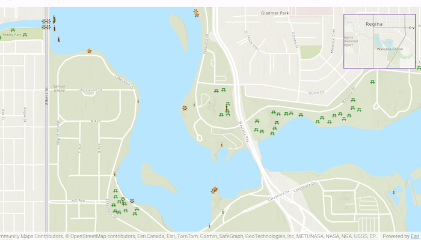

# Display overview map

Include an overview or inset map as an additional map view
to show the wider context of the primary view.

## Use case

An overview map provides a useful, smaller-scale overview of the current map view's location.
For example, when you need to inspect a layer with many features while remaining aware of the
wider context of the view, use an overview map to help show the extent of the main map view.

## How to use the sample

Pan or zoom across the map view to browse through the tourist attractions feature layer and
notice the viewpoint and scale of the linked overview map update automatically.

## How it works

1. Create a `Viewpoint` and `Polygon`.
2. Instantiate a `FeatureLayer` from a `ServiceFeatureTable`.
3. Create an `ArcGISMap` object and pass `Viewpoint` to initialViewpoint and add `FeatureLayer` into operationalLayers.
4. In the user-interface, declare `MapView` and set the map to previously created `ArcGISMap`, set `onViewpointChangedForCenterAndScale` to update previously created `Viewpoint` and set `onVisibleAreaChanged` to update previously created `Polygon`.
5. In the user-interface, declare an `OverviewMap` object from the ArcGIS Maps SDK Toolkit and set `viewpoint` to previously created `Viewpoint` and `visibleArea`to previously created `Polygon`

## Relevant API

* ArcGISMap
* MapView
* OverviewMap

## Tags

context, inset, map, minimap, overview, preview, small scale, toolkit, view
