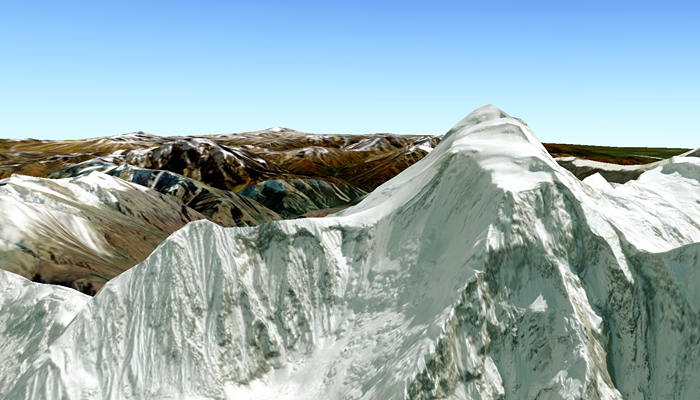

# Display scene

Display a scene with a terrain surface and some imagery.

## Use case

Scene views are 3D representations of real-world areas and objects. Scene views are helpful for visualizing complex datasets where 3D relationships, topography, and elevation of elements are important factors.

## How to use the sample

When loaded, the sample will display a scene. Pan and zoom to explore the scene.

## How it works

1. Create an `ArcGISScene` object with the `BasemapStyle.ArcGISImagery` basemap.
2. Create an `ArcGISTiledElevationSource` object and add it to the scene's base surface.
3. Create a `SceneView` object to display the scene.
4. Set a `Camera` to the view using `SceneView.setViewpointCamera()`
5. Set the scene to the scene view.

## Relevant API

* ArcGISScene
* ArcGISTiledElevationSource
* BasemapStyle
* Camera
* SceneView

## Tags

3d, basemap, elevation, scene, surface
