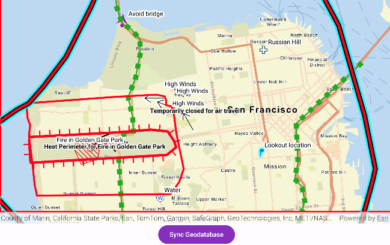

# Edit and sync features with feature service

Synchronize offline edits with a feature service.

## Use case

A survey worker who works in an area without an internet connection could take a geodatabase of survey features offline at their office, make edits and add new features to the offline geodatabase in the field, and sync the updates with the online feature service after returning to the office.

## How to use the sample

Pan and zoom into the desired area, making sure the area you want to take offline is within the current extent of the map view. Tap on the "Generate Geodatabase" button to take the area offline. When complete, the map will update with a red outline around the offline area. To edit features, tap to select a feature, and tap again anywhere else on the map to move the selected feature to the tapped location. To sync the edits with the feature service, click the "Sync geodatabase" button.

## How it works

1. Create a `GeodatabaseSyncTask` from a URL to a feature service.
2. Use `createDefaultGenerateGeodatabaseParameters()` on the geodatabase sync task to create `GenerateGeodatabaseParameters`, passing in an `Envelope` extent as the parameter.
3. Create a `GenerateGeodatabaseJob` from the `GeodatabaseSyncTask` using `createGenerateGeodatabaseJob(...)` passing in parameters and a path to the local geodatabase.
4. Start the job and get the result `Geodatabase`.
5. Load the geodatabase and get its feature tables. Create feature layers from the feature tables and add them to the map's operational layers collection.
6. Create `SyncGeodatabaseParameters` and set the sync direction.
7. Create a `SyncGeodatabaseJob` from `GeodatabaseSyncTask` using `.createSyncGeodatabaseJob(...)` passing in the parameters and geodatabase as arguments.
8. Start the sync job to synchronize the edits with `syncGeodatabaseJob.start()`.

## Relevant API

* FeatureLayer
* FeatureTable
* GenerateGeodatabaseJob
* GenerateGeodatabaseParameters
* GeodatabaseSyncTask
* SyncGeodatabaseJob
* SyncGeodatabaseParameters
* SyncLayerOption

## Additional information

This sample uses the GeoView-Compose Toolkit module to be able to implement a composable MapView.

## Tags

feature service, geodatabase, geoview-compose, offline, synchronize
