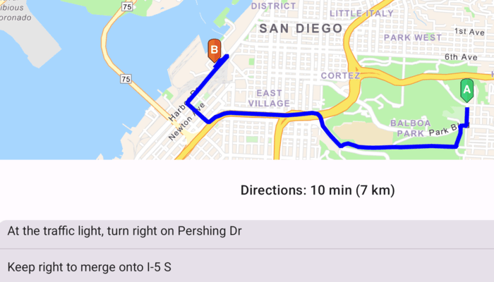

# Find route

Display directions for a route between two points.

## Use case

Find routes with driving directions between any number of locations. You might use the ArcGIS platform to create a custom network for routing on a private roads.

## How to use the sample

For simplicity, the sample comes loaded with a start and end stop. You can tap on the floating action button to display a route between these stops. Once the route is generated, turn-by-turn directions are shown in an expandable bottom sheet. Tap on a direction to zoom to that portion of the route.

## How it works

1. Set the `ArcGISEnvironment.applicationContext` to use a `RouteTask`
2. Create a `RouteTask` using a URL to an online route service.
3. Generate default `RouteParameters` using `routeTask.createDefaultParameters()`.
4. Set `returnDirections` on the parameters to true.
5. Add `Stop`s to the parameters `stops` collection for each destination.
6. Solve the route using `routeTask.solveRoute(routeParameters)` to get a `RouteResult`.
7. Iterate through the result's `Route`s. To display the route, create a graphic using the geometry from `route.routeGeometry`. To display directions, use `route.directionManeuvers`, and for each `DirectionManeuver`, display `DirectionManeuver.directionText`.

## Relevant API

* DirectionManeuver
* Route
* RouteParameters
* RouteResult
* RouteTask
* Stop

## Additional information

This sample uses the GeoView-Compose Toolkit module to be able to implement a composable MapView.

## Tags

directions, driving, geoview-compose, navigation, network, network analysis, route, routing, shortest path, toolkit, turn-by-turn
