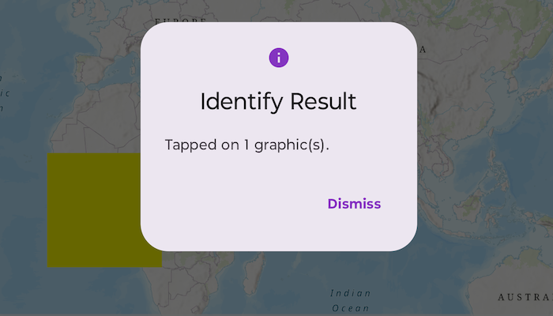

# Identify graphics

Display a message when a graphic on the map is tapped.

## Use case

A user may wish to select a graphic on a map to view relevant information about it.

## How to use the sample

Tap on a graphic to identify it. You will see an alert message displayed.

## How it works

1. Create a `GraphicsOverlay` and add it to the MapView.
2. Build a Graphic from a `Polygon` and a `SimpleFillSymbol` and add it to the graphics overlay.
3. Listen for MapView.onSingleTapConfirmed to obtain the ScreenCoordinate where the user tapped.
4. Identify the graphic on the map view using `MapViewProxy.identify` function while providing the `graphicsOverlay`, `screenCoordinate`, `tolerance`, `maximumResults`.

## Relevant API

- Graphic
- GraphicsOverlay
- IdentifyGraphicsOverlayResult
- MapView
- MapViewProxy

## Notes

- The tolerance controls the radius (in device-independent pixels) around the tap used during the identify operation.
- You can use MapViewProxy.identifyGraphicsOverlays to run the identify operation across all graphics overlays at once.

## Tags

graphics, identify
