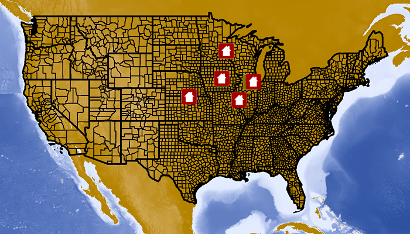

# Manage operational layers

Add, remove, and reorder operational layers in a map.

## Use case

Operational layers display the primary content of the map and usually provide dynamic content for the user to interact with (as opposed to basemap layers that provide context).

The order of operational layers in a map determines the visual hierarchy of layers in the view. You can bring attention to a specific layer by rendering it above other layers.

## How to use the sample

When the app starts, the display lists of operational layers and any removed layers. Tap the up/down buttons to change its position, or the visibility button to add it from the map. Tap removed layers to add them back to the map. The map will be updated automatically.

## How it works

1. Get the operational layers `MutableList<Layer>` from the map using `map.operationalLayers`.
2. Add or remove layers using `mutableLayerList.add(layer)` and `layerList.remove(layer)` respectively. The last layer in the list will be rendered on top.

## Relevant API

* ArcGISMap
* ArcGISMapImageLayer
* LayerList

## Additional information

This sample uses the GeoView-Compose Toolkit module to be able to implement a composable MapView.
You cannot add the same layer to the map multiple times or add the same layer to multiple maps. Instead, clone the layer with `layer.clone()` before duplicating.

## Tags

add, delete, geoview-compose, layer, map, remove, toolkit
