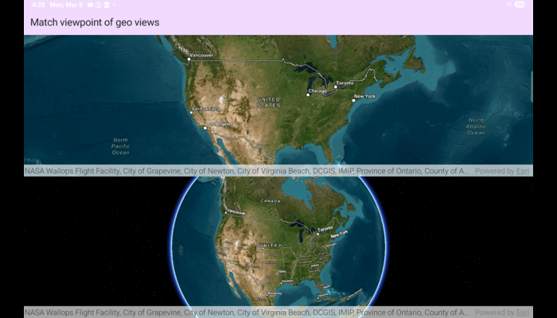

# MatchViewpointOfGeoViews

This sample demonstrates how to keep the viewpoints of two GeoViews (a 2D MapView and a 3D SceneView) synchronized with each other.

## Use case

You might need to synchronize `GeoView` viewpoints if you had two map views in one application - a main map and an inset. An inset map view could display all the layers at their full extent and contain a hollow rectangular graphic that represents the visible extent of the main map view. As you zoom or pan in the main map view, the extent graphic in the inset map would adjust accordingly.

## How to use the sample

Interact with the map view or scene view by zooming or panning. The other map view or scene view will automatically focus on the same viewpoint.

## How it works

1. The ViewModel creates two containers: an ArcGISMap and an ArcGISScene. Both are initialized with the same initial Viewpoint (center coordinate and scale).
2. The ViewModel also exposes a MapViewProxy and a SceneViewProxy. These proxies provide convenience functions to set viewpoints on the map/scene from the ViewModel without needing direct MapView/SceneView references.
3. Each GeoView composable registers two callbacks:
   * onNavigationChanged: notifies when the user is actively navigating (panning/zooming/rotating).
   * onViewpointChangedForCenterAndScale: notifies about center-and-scale viewpoint updates.
4. When the MapView viewpoint changes and the SceneView is not currently navigating, the ViewModel sets the SceneViewProxy to the new viewpoint. Symmetrically, when the SceneView viewpoint changes and the MapView is not navigating, the ViewModel sets the MapViewProxy to that viewpoint.

## Relevant API

* GeoView
* MapView
* SceneView
* Viewpoint

## About the data

This application provides two different perspectives of the `arcGISImagery` basemap, A 2D `MapView` as well as a 3D `SceneView`, displayed on top of one another.

## Tags

3D, automatic refresh, event, event handler, events, extent, interaction, interactions, pan, zoom
