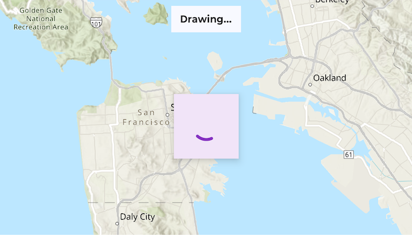

# Monitor changes to draw status

Get the draw status of your map view or scene view to know when all layers in the map or scene have finished drawing.

## Use case

Display an indicator of layers drawing.

## How to use the sample

1. Pan and zoom around the map.
2. Observe the draw status text in the toolbar and the progress indicator while the map is drawing.

## How it works

1. Create an ArcGISMap.
2. Pass the ArcGISMap to the Compose MapView.
3. Use the MapView onDrawStatusChanged callback to receive DrawStatus updates

## Relevant API

* ArcGISMap
* DrawStatus
* MapView

## Tags

draw, loading, map, render
