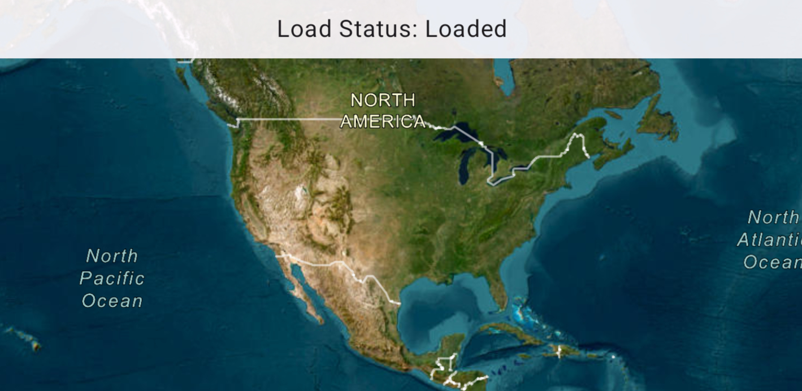

# Monitor changes to map load status

Determine the map's load status which can be: `NOT_LOADED`, `FAILED_TO_LOAD`, `LOADING`, `LOADED`.

## Use case

Knowing the map's load state may be required before subsequent actions can be executed.

## How to use the sample

Click on the button to reload the ArcGISMap. The load status of the ArcGISMap will be displayed on screen.

## How it works

The `LoadStatus` is `LOADED` when any of the following criteria are met:

* The map has a valid spatial reference.
* The map has an an initial viewpoint.
* One of the map's predefined layers has been created.

## Relevant API

* ArcGISMap
* LoadStatus StateFlow
* MapView

## Tags

load status, loadable pattern, map
