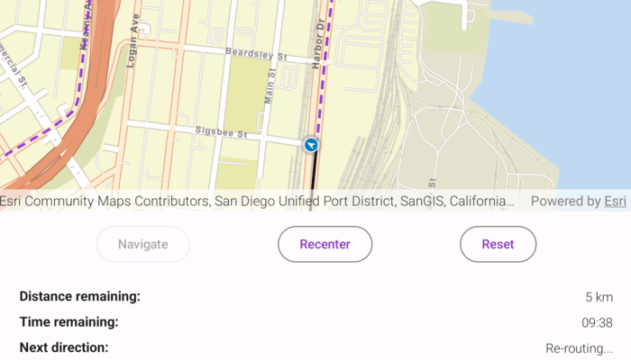

# Navigate route with rerouting

Navigate between two points and dynamically recalculate an alternate route when the original route is unavailable.

## Use case

While traveling between destinations, field workers use navigation to get live directions based on their locations. In cases where a field worker makes a wrong turn, or if the route suggested is blocked due to a road closure, it is necessary to calculate an alternate route to the original destination.

## How to use the sample

Tap "Navigate" to simulate traveling and to receive directions from a preset starting point to a preset destination. Observe how the route is recalculated when the simulation does not follow the suggested route. Tap "Recenter" to reposition the viewpoint. Tap "Reset" to start the simulation from the beginning.

## How it works

1. Create a `RouteTask` using local network data.
2. Generate default `RouteParameters` using `RouteTask.createDefaultParameters()`.
3. Set `returnRoutes`, `returnStops`, and `returnDirections` on the `RouteParameters` to `true`.
4. Add `Stop`s to the parameters' list of `stops` using `RouteParameters.setStops()`.
5. Solve the route using `routeTask.solveRoute(routeParameters)` to get an `RouteResult`.
6. Create an `RouteTracker` using the route result, and the index of the desired route to take.
7. Enable rerouting in the route tracker using `routeTracker.enableRerouting(reroutingParameters)`. Pass `ReroutingStrategy.ToNextWaypoint` as the value of `strategy` to specify that in the case of a reroute, the new route goes from present location to next waypoint or stop.
8. Implement `RouteTracker.trackLocation()` to track the location of the device and update the route tracking status.
9. Implement `RouteTracker.TrackingStatusChangedListener()` to be notified of `TrackingStatus` changes, and use them to display updated route information. `TrackingStatus` includes a variety of information on the route progress, such as the remaining distance, remaining geometry or traversed geometry (represented by an `Polyline`), or the remaining time (`Double`), amongst others.
10. You can also query the tracking status for the current `DirectionManeuver` index by retrieving that maneuver from the `Route` and getting its direction text to display in the GUI.
11. To establish whether the destination has been reached, get the `DestinationStatus` from the tracking status. If the destination status is `DestinationStatus.Reached` and the `DirectionManeuvers.size` is 1, you have arrived at the destination and can stop routing. If there are several destinations on your route and the remaining destination count is greater than 1, switch the route tracker to the next destination.

## Relevant API

* DestinationStatus
* DirectionManeuver
* Location
* LocationDataSource
* ReroutingStrategy
* Route
* RouteParameters
* RouteTask
* RouteTracker
* RouteTrackerLocationDataSource
* SimulatedLocationDataSource
* Stop
* VoiceGuidance

## About the data

The [San Diego Geodatabase](https://arcgisruntime.maps.arcgis.com/home/item.html?id=df193653ed39449195af0c9725701dca) route taken in this sample goes from the San Diego Convention Center, site of the annual Esri User Conference, to the Fleet Science Center, San Diego.

## Additional information

The route tracker will start a rerouting calculation automatically as necessary when the device's location indicates that it is off-route. The route tracker also validates that the device is "on" the transportation network. If it is not (e.g. in a parking lot), rerouting will not occur until the device location indicates that it is back "on" the transportation network.

## Tags

directions, maneuver, navigation, route, turn-by-turn, voice
