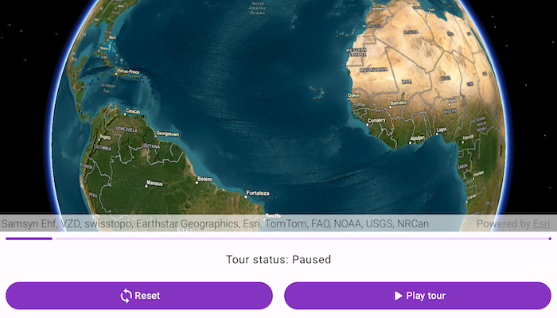

# Play KML tour

Play tours in KML files.

## Use case

KML, the file format used by Google Earth, supports creating tours, which can control the viewpoint of the scene, hide and show content, and play audio. Tours allow you to easily share tours of geographic locations, which can be augmented with rich multimedia. Runtime allows you to consume these tours using a simple API.

## How to use the sample

The sample will load the KMZ file from ArcGIS Online. When a tour is found, the _Play_ button will be enabled. Use _Play_ and _Pause_ to control the tour. When you're ready to show the tour, use the reset button to return the tour to the unplayed state.

## How it works

1. Create a `KmlDataSet` from the local kmz file and instantiate a layer from it with `KmlLayer(kmlDataSet)`.
2. Create the KML tour controller. Wire up the buttons to the `KmlTourController.play()`, `KmlTourController.pause()`, and `KmlTourController.reset()` methods.
3. Explore the tree of KML content to find the first KML tour. Once a tour is found, provide it to the KML tour controller.

## Relevant API

* KmlTour
* KmlTourController
* KmlTourController.pause()
* KmlTourController.play()
* KmlTourController.reset()

## About the data

This sample uses a custom tour from [ArcGIS Online](https://arcgisruntime.maps.arcgis.com/home/item.html?id=f10b1d37fdd645c9bc9b189fb546307c). When you play the tour, you'll go through a audio journey through some of Esri's offices.

## Additional information

See [Touring in KML](https://developers.google.com/kml/documentation/touring) in *Keyhole Markup Language* for more information.

This sample uses the GeoView-Compose Toolkit module to be able to implement a composable SceneView.

## Tags

animation, geoview-compose, interactive, KML, narration, pause, play, story, toolkit, tour
