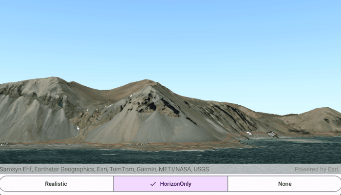

# Set atmosphere effect in scene

Changes the appearance of the atmosphere in a scene.

## Use case

Atmospheric effect can be used to make the scene view look more realistic.

## How to use the sample

Select one of the three available atmosphere effects. The sky will change to display the selected atmosphere effect.

## How it works

1. Create an ArcGISScene and add it to a SceneView composable.
2. Expose the selected AtmosphereEffect from a ViewModel and observe it in the Compose screen using collectAsState or collectAsStateWithLifecycle.
3. Pass the AtmosphereEffect value into the SceneView composable (the toolkit SceneView accepts an atmosphereEffect parameter) so changing the selected value updates the composable SceneView rendering.

## Relevant API

* AtmosphereEffect
* ArcGISScene
* SceneView
* Viewpoint
* ArcGISTiledElevationSource

## About the data

There are three atmosphere effect options:

* Realistic - A realistic atmosphere effect is applied over the entire surface.
* HorizonOnly - Atmosphere effect applied to the sky (horizon) only.
* None - No atmosphere effect. The sky is rendered black with a starfield consisting of randomly placed white dots.

## Tags

atmosphere, horizon, sky, scene, SceneView, Compose, Kotlin
