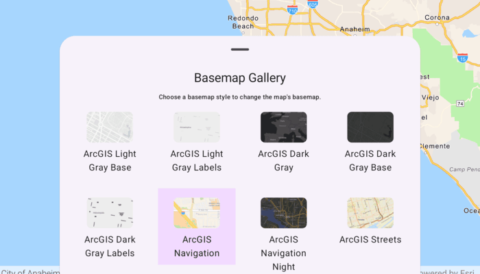

# Set basemap

Change a map's basemap.

## Use case

A basemap draws beneath all layers on a `Map` or `Scene` and is used to provide visual reference for the operational layers. Basemaps should be selected contextually. For example, in maritime applications, it would be more appropriate to use a basemap of the world's oceans as opposed to a basemap of the world's streets.

## How to use the sample

Open the sample and browse the basemap list shown in the bottom sheet. Tap a basemap to set it as the map's basemap. The map updates immediately to reflect the new style.

## How it works

1. Create a `Map` object with the `arcGISImagery` basemap style.
2. Display the map using the MapView composable from the ArcGIS Maps SDK for Kotlin Toolkit.
3. Load `BasemapStylesService` to retrieve the available basemap styles. 
4. For each `BasemapStyleInfo` returned, create a `BasemapGalleryItem` and display them in the `BasemapGallery` Toolkit composable.
5. When BasemapGalleryItem is tapped, update the current map's basemap using:
    * `arcGISMap.setBasemap(Basemap(basemapStyleInfo.style))`

## Relevant API

* ArcGISMap
* Basemap
* BasemapGallery
* BasemapGalleryItem
* BasemapStyle
* BasemapStyleInfo
* BasemapStylesService
* MapView

## Additional information

Organizational basemaps are a `Portal` feature allowing organizations to specify basemaps for use throughout the organization. Customers expect that they will have access to their organization's standard basemap set when they connect to a `Portal`. Organizational basemaps are useful when certain basemaps are particularly relevant to the organization, or if the organization wants to make premium basemap content available to their workers.

This samples uses the `BasemapGallery` toolkit component, which requires the [ArcGIS Maps SDK for Kotlin Toolkit](https://github.com/Esri/arcgis-maps-sdk-kotlin-toolkit). The `BasemapGallery` toolkit component supports selecting 2D and 3D basemaps from ArcGIS Online, a user-defined portal, or an array of Basemaps.

## Tags

basemap, map
