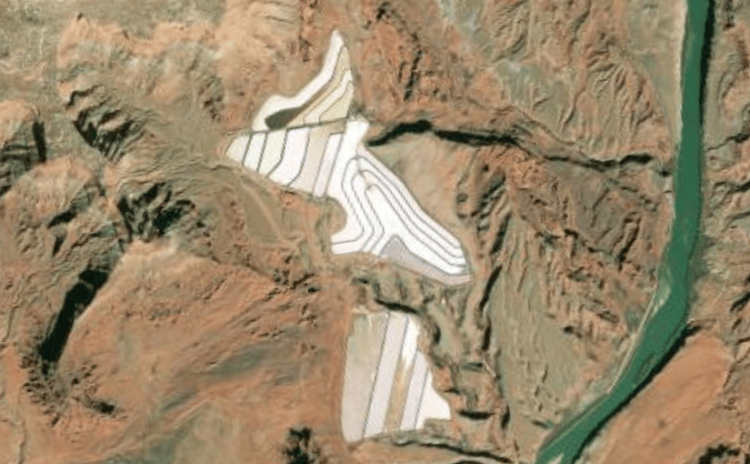

# Set initial viewpoint

Display the map at an initial viewpoint representing a bounding geometry.

## Use case

Setting the initial viewpoint is useful when a user wishes to first load the map at a particular area of interest.

## How to use the sample

When the sample loads, note the map is opened at the initial view point that is set to it.

## How it works

1. Create an ArcGISMap and specify a basemap style (for example, BasemapStyle.ArcGISImageryStandard).
2. Define an Envelope in Web Mercator representing the bounding coordinates of the desired startup area.
3. Construct a Viewpoint using the envelope (Viewpoint(boundingGeometry = envelope)).
4. Assign the Viewpoint to the map using arcGISMap.initialViewpoint.
5. Provide the ArcGISMap to the MapView composable so the MapView opens at the configured initial viewpoint.

## Relevant API

* ArcGISMap
* Envelope
* MapView
* SpatialReference
* Viewpoint

## Tags
envelope, extent, initial viewpoint, zoom

